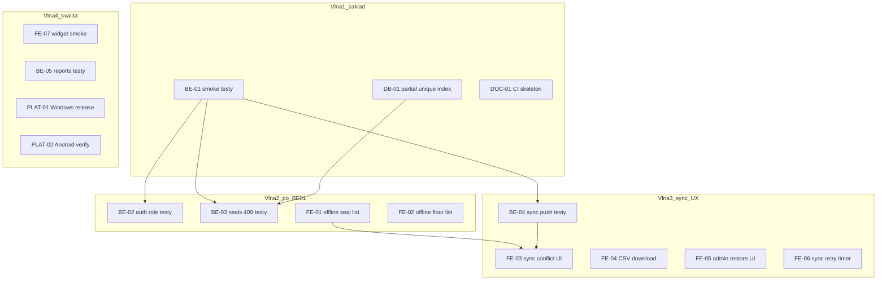
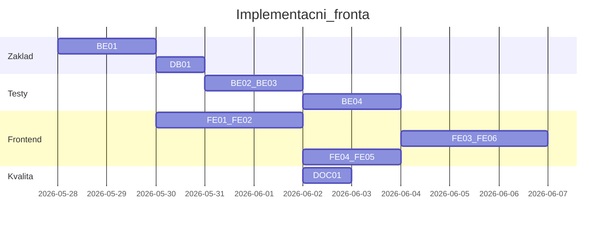
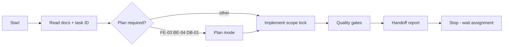

# AGENT_ORCHESTRATION.md – koordinace implementace Ucpávky V1

Operační příručka pro více agentů / paralelní práci.  
**Zdroje pravdy:** [PROJECT_STATUS.md](PROJECT_STATUS.md), [RUNNING.md](RUNNING.md), [KNOWN_ISSUES.md](KNOWN_ISSUES.md), [frontend/FRONTEND_STATUS.md](frontend/FRONTEND_STATUS.md), [docs/](docs/).

**Zásady (neporušovat):** žádné refactory „za pochodu“, žádná změna business logiky bez tasku ve spec, malé dify, offline-first a sync pravidla z [docs/SYNC.md](docs/SYNC.md).

---

## 0. Role koordinátora

| Role | Odpovědnost |
|------|-------------|
| **Koordinátor** (uživatel nebo hlavní agent) | Přiděluje task ID, schvaluje pořadí, povoluje commit, řeší konflikty |
| **Implementační agent** | Jeden task ID, scope lock, handoff po dokončení |

**Před každým taskem agent přečte:**

1. [PROJECT_STATUS.md](PROJECT_STATUS.md) – aktuální stav
2. Příslušný docs soubor (např. [docs/SYNC.md](docs/SYNC.md) pro sync tasky)
3. [RUNNING.md](RUNNING.md) – runtime (PostgreSQL bez Dockeru, port 3000)

**Runtime předpoklady:** lokální PostgreSQL `localhost:5432`, backend `npm run dev`, seed `worker1/1234`, stavba `12345678`.

---

## 1. Katalog tasků

Každý task: **ID**, cíl, soubory, závislosti, ověření, riziko.

### Přehled závislostí



### Track BE – Backend testy a stabilita

| ID | Název | Scope | Závisí na | Ověření | Riziko |
|----|-------|-------|----------|---------|--------|
| **BE-01** | Smoke integrační testy | `backend/__tests__/`, Jest setup, `ucpavky_test` | PostgreSQL | `npm test` | nízké |
| **BE-02** | Auth + role 403 | `backend/__tests__/auth.*` | BE-01 | `npm test` | nízké |
| **BE-03** | Seals duplicita + status | `backend/__tests__/seals.*` | BE-01, DB-01 | `npm test` | střední |
| **BE-04** | Sync push idempotence/konflikt | `backend/__tests__/sync.*` | BE-01 | `npm test` | střední |
| **BE-05** | Reports CSV/PDF smoke | `backend/__tests__/reports.*` | BE-01 | `npm test` | nízké |

**BE-01 detail:** supertest proti `createApp()`, DB `ucpavky_test`, endpointy: `/health`, login, `/api/jobs`, `/api/jobs/by-number/12345678`, floors. Viz [docs/TESTING.md](docs/TESTING.md).

### Track DB – Migrace (bez business logiky)

| ID | Název | Scope | Závisí na | Ověření | Riziko |
|----|-------|-------|----------|---------|--------|
| **DB-01** | Partial unique index `seals_active_number_unique` | `prisma/migrations/` dle [docs/DATABASE.md](docs/DATABASE.md) | — | migrate + `npm test` | nízké |

```sql
CREATE UNIQUE INDEX seals_active_number_unique
ON seals (job_id, floor_id, seal_number)
WHERE deleted_at IS NULL;
```

### Track FE – Frontend dokončení (bez refaktoru sync service)

| ID | Název | Scope | Závisí na | Ověření | Riziko |
|----|-------|-------|----------|---------|--------|
| **FE-01** | Offline read: `SealListScreen` | `seal_list_screen.dart` + Drift | — | integrační + offline checklist | střední |
| **FE-02** | Offline read: `FloorListScreen` | `floor_list_screen.dart` | FE-01 pattern | stejné | střední |
| **FE-03** | Sync conflict UI | `sync_screen.dart` + konflikty | BE-04 doporučeno | checklist § Konflikty | střední |
| **FE-04** | CSV download | `reports_screen.dart` | backend běží | export checklist | nízké |
| **FE-05** | Admin restore UI | `seal_detail_screen.dart` | role admin | checklist § Data | nízké |
| **FE-06** | Sync retry timer | `sync_service.dart` | [docs/SYNC.md](docs/SYNC.md) | offline checklist | střední |
| **FE-07** | Widget smoke login→home | `frontend/test/` | — | `flutter test` | nízké |

### Track DOC / PLAT – Infra (volitelné)

| ID | Název | Scope | Riziko |
|----|-------|-------|--------|
| **DOC-01** | GitHub Actions | `.github/workflows/ci.yml`, [docs/CI.md](docs/CI.md) | nízké (hotovo) |
| **PLAT-01** | Windows Release build | `frontend/windows/` | nízké |
| **PLAT-02** | Android build verify | docs + build | nízké |

### Mimo scope V1 (agentům zakázat)

Push notifikace, ceník, diskuze, web/Chrome target, Docker jako primární runtime, refaktor celého sync modulu, změna API kontraktů bez tasku.

---

## 2. Paralelizace

### Mohou běžet paralelně

| Kombinace | Podmínka |
|-----------|----------|
| BE-01 ∥ DB-01 | DB migrace nesahá na Jest setup; test DB oddělená |
| BE-01 ∥ FE-01 ∥ FE-04 ∥ FE-07 | žádný společný soubor |
| FE-01 → FE-02 | po vzoru FE-01; FE-02 může navázat hned po merge FE-01 |
| DOC-01 ∥ libovolný track | jen CI yaml |
| PLAT-01 ∥ PLAT-02 | platformové |

### Nesmí běžet paralelně

| Konflikt | Důvod |
|----------|-------|
| **DB-01 ∥ BE-03** bez pořadí DB→BE-03 | BE-03 testuje duplicitu na DB |
| **FE-03 ∥ BE-04** bez hotového BE-04 | UI bez ověřeného API |
| **FE-06 ∥ FE-03** | oba mění sync flow |
| **Více agentů na stejný task ID** | merge konflikty |
| **Refaktor `schema.prisma`** mimo DB task | jen cílené migrace |
| **Dva agenti na `sync.routes.ts`** | kritická cesta |

### Doporučená vlna 1 (start)

| Agent | Task |
|-------|------|
| A | BE-01 |
| B | DB-01 (po nebo s BE-01; test DB `ucpavky_test`) |
| C | FE-04 nebo FE-07 |

---

## 3. Pořadí implementace

| # | Task | Důvod |
|---|------|-------|
| 1 | **BE-01** | základ regrese, nejnižší riziko |
| 2 | **DB-01** | integrita dat před seals/sync testy |
| 3 | **BE-02**, **BE-03** | paralelně po BE-01 + DB-01 |
| 4 | **FE-01** → **FE-02** | offline pro workery |
| 5 | **BE-04** | před konfliktním UI |
| 6 | **FE-06** → **FE-03** | sekvenčně (sync modul) |
| 7 | **FE-04**, **FE-05** | management UX |
| 8 | **BE-05**, **FE-07** | reports + widget |
| 9 | **DOC-01** | až stabilní BE-01 + FE integrace |
| 10 | **PLAT-01**, **PLAT-02** | volitelné |



---

## 4. Pravidla pro commity

1. **1 commit = 1 task ID** v subjectu: `BE-01: add API smoke tests`, `FE-01: offline seal list from Drift`.
2. **Commit jen na pokyn** koordinátora po zelené kontrole (§6).
3. **Nikdy v commitu:** `.env`, `backend/.env`, `uploads/`, `node_modules/`, build artefakty.
4. **Migrace:** samostatný commit `DB-01: ...`.
5. **Obsah commitu:** testy + minimální kód; žádné drive-by formátování.
6. **Žádný amend** pokud commit nebyl od stejné session / už pushnuto.
7. **Docs stavu:** `PROJECT_STATUS.md` / `FRONTEND_STATUS.md` aktualizuje koordinátor nebo agent v rámci stejného task commitu.

**Formát zprávy:**

```
BE-01: add supertest smoke tests against ucpavky_test

- Jest globalSetup: migrate + seed on test DB
- Covers health, login, jobs, by-number, floors
```

---

## 5. Pravidla agent workflow



| Fáze | Akce |
|------|------|
| **Start** | Task ID, `PROJECT_STATUS.md`, relevantní docs, [RUNNING.md](RUNNING.md) |
| **Plan** | Povinně pro FE-03, BE-04, DB-01 |
| **Scope lock** | Uvést „Nesahej na:“; max soubory z tabulky tasku |
| **Implement** | Agent mode; žádné featury mimo task |
| **Verify** | §6 gates |
| **Handoff** | Šablona níže |
| **Stop** | Nepokračovat na další task bez přidělení |

**Typ agenta:**

| Track | Zaměření |
|-------|----------|
| BE-* / DB-* | backend + shell, test DB |
| FE-* | Flutter; API na `:3000` pro integrační test |
| DOC-* / PLAT-* | CI, platform build, docs |

**Zakázané:** refaktor za pochodu, mock API v `lib/`, Docker jako předpoklad ([KNOWN_ISSUES.md](KNOWN_ISSUES.md)), změna kontraktů bez tasku.

---

## 6. Kontrola po každém tasku (quality gates)

### Gate A – Automatické

| Track | Příkazy |
|-------|---------|
| BE-* | `cd backend && npm test` |
| DB-* | `npx prisma migrate deploy` (test/dev DB dle tasku) + `npm test` |
| FE-* | `flutter analyze` + `flutter test test/integration/runtime_verification_test.dart` |
| FE-01/02/03 | + [docs/04_TESTOVACI_CHECKLIST.md](docs/04_TESTOVACI_CHECKLIST.md) § Offline / Konflikty |
| DOC-01 | push/PR → `.github/workflows/ci.yml` green (viz [docs/CI.md](docs/CI.md)) |

**Test DB (BE-*):** `ucpavky_test` – viz [docs/setup-local-postgres-test.sql](docs/setup-local-postgres-test.sql), [docs/TESTING.md](docs/TESTING.md).

### Gate B – Regrese

- [ ] `GET /health` → 200
- [ ] `POST /api/auth/login` worker1 → token (pokud task sahal na API)
- [ ] Flutter integrace 6/6 green (pokud task sahal na FE nebo sdílené API)

### Gate C – Dokumentace

Aktualizovat **jeden** z: `PROJECT_STATUS.md`, `FRONTEND_STATUS.md`, `KNOWN_ISSUES.md` – jen pokud task mění chování nebo odhalí nový problém.

### Gate D – Schválení

| Výsledek | Akce |
|----------|------|
| Vše green | koordinátor povolí commit |
| Flaky test | task otevřen; záznam do `KNOWN_ISSUES.md` |
| Scope violation | revert nebo nový task |

### Šablona handoff

```markdown
## Handoff: [TASK-ID]

**Změněné soubory:**
- ...

**Ověření:**
- `npm test` → PASS/FAIL
- `flutter test ...` → PASS/FAIL (pokud relevantní)

**Checklist (docs/04):**
- [ ] ...

**Rizika / follow-up:**
- ...

**Další doporučený task:**
- ...
```

---

## 7. Rizikové zóny (watchlist)

| Zóna | Pravidlo |
|------|----------|
| `backend/src/routes/sync.routes.ts` | max 1 agent; po BE-04 |
| `frontend/lib/features/sync/` | FE-06 před FE-03 |
| `prisma/migrations/` | pouze DB-* tasky |
| `backend/prisma/schema.prisma` | žádný refactor mimo DB task |
| Konfliktní merge na `main` | řeší koordinátor |

---

## Příloha – mapování PROJECT_STATUS → task ID

| PROJECT_STATUS §9 | Orchestrace ID |
|-------------------|----------------|
| Task A – Backend smoke testy | **BE-01** |
| Task B – Partial unique index | **DB-01** |
| Task C – Offline seal list | **FE-01** (+ FE-02 pro patra) |

---

## Příloha – rychlé odkazy

| Dokument | Účel |
|----------|------|
| [PROJECT_STATUS.md](PROJECT_STATUS.md) | audit stavu |
| [RUNNING.md](RUNNING.md) | spuštění backendu |
| [docs/TESTING.md](docs/TESTING.md) | automatické testy |
| [docs/04_TESTOVACI_CHECKLIST.md](docs/04_TESTOVACI_CHECKLIST.md) | manuální UAT |
| [docs/03_TASKY_PRO_CURSOR.md](docs/03_TASKY_PRO_CURSOR.md) | původní task struktura |
