# BUGFIX_AND_CHANGE_PLAN_V1_1

Technický audit bugů a požadovaných změn — aplikace pro evidenci požárních ucpávek (Unifast).

**Verze dokumentu:** 1.1  
**Datum auditu:** 2026-06-01  
**Rozsah auditu:** synchronizace, fotky, formulář prostupů, export, oprávnění worker, duplicitní číslo, role, PIN, logy.

**Omezení tohoto dokumentu (implementační fáze):**

- Neimplementovat kód v rámci tohoto dokumentu.
- Neměnit business logiku bez samostatného schválení.
- Neměnit API kontrakty bez samostatného schválení.
- Neměnit databázové migrace (PostgreSQL/Prisma) bez samostatného schválení.
- Nevádět refactory.
- **Nezavádět nové statusy ucpávky** (`draft`, `checked`, `invoiced` zůstávají beze změny).

**Reference:** [`docs/01_KOMPLETNI_SPECIFIKACE.md`](docs/01_KOMPLETNI_SPECIFIKACE.md), [`docs/SYNC.md`](docs/SYNC.md), [`KNOWN_ISSUES.md`](KNOWN_ISSUES.md).

---

## 1. Kritické bugy

### 1.1 Synchronizace (S1–S7)

| ID | Oblast | Projev | Závažnost |
|----|--------|--------|-----------|
| **S1** | Sync | Po „úspěšné“ synchronizaci ucpávka zmizí ze seznamu patra nebo působí, že se neuložila | Kritická |
| **S2** | Sync | `pull` přepíše lokální `isSynced` / `syncConflict` u stažených ucpávek | Kritická |
| **S3** | Sync | Počet čekajících sync položek v UI neodpovídá tomu, co se skutečně synchronizuje (zahrnuje `failed` v backoffu) | Střední |
| **S4** | Sync | Pending sync a pending fotky vidí všichni uživatelé na stejném zařízení; logout nečistí lokální frontu | Kritická (integrita dat) |
| **S5** | Sync / status | Změna statusu ucpávky není součástí offline fronty; worker nemění status offline | Střední |
| **S6** | Sync | V push schématu existuje `operation: status`, ale server ho nezpracovává | Střední |
| **S7** | Sync | Při kratší odpovědi serveru než počet odeslaných mutací zůstanou položky outboxu nezpracované | Střední |

### 1.2 Fotky (P1–P3)

| ID | Oblast | Projev | Závažnost |
|----|--------|--------|-----------|
| **P1** | Fotky | Upload fotek je přeskočen, pokud ucpávka není `isSynced` nebo má `syncConflict` — fotky zůstávají v `pending`/`failed` (často důsledek S1/S2) | Kritická |
| **P2** | Fotky | Na iOS chybí popisy oprávnění pro kameru a galerii v `Info.plist` | Kritická (iOS) |
| **P3** | Fotky | Offline zobrazení fotek stažených ze serveru — v cache není lokální binární soubor | Střední |

### 1.3 Požadované změny (ne klasifikované jako bugy)

| ID | Oblast | Požadavek |
|----|--------|-----------|
| **F1** | Formulář prostupy | U hlavní ucpávky se vybere systém; u dalších prostupů nemá worker znovu vybírat materiály — dědí se z prvního prostupu / hlavní ucpávky |
| **E1** | Export | Filtry: pracovník, zakázka (stavba), patro, status, období |
| **E2** | Export | Umožnit zvolit vlastní cestu/adresu uložení souboru CSV/PDF |
| **R1** | Role | Rozdělit vedení na `vedeni` a `ucetni`; účetní = exporty/reporty/fakturace, bez editace technických dat ucpávek |
| **D1** | Duplicita čísla | Jasná chyba, možnost číslo hned opravit, u offline sync konfliktu jasná identifikace ucpávky |
| **W1** | Worker oprávnění | Worker smí editovat jakoukoliv ucpávku ve stavu draft; audit; `createdBy` zachován; `updatedBy`/`updatedAt` = poslední editor |
| **L1** | Logy | Rozdělit logy (auth, audit/change, sync, error, photo, admin) — ne jeden společný pohled |

**PIN (ověření stavu):** Změna PINu workerem a vynucení po prvním přihlášení jsou na backendu a ve Flutter routeru **částečně implementovány** — viz sekce 4 a task T-PIN v pořadí implementace.

---

## 2. Pravděpodobná příčina každého bugu

### S1 — Data po sync „neuložena“

- [`frontend/lib/features/seals/seal_list_screen.dart`](frontend/lib/features/seals/seal_list_screen.dart) — `_mergeWithUnsyncedLocal` přidává do seznamu jen lokální řádky s `isSynced == false`.
- Po úspěšném push [`sync_service.dart`](frontend/lib/features/sync/sync_service.dart) nastaví `isSynced: true` (~ř. 149–156).
- API seznam ucpávek na patře může ucpávku ještě neobsahovat → po sync zmizí z merged UI, i když je na serveru.

### S2 — Pull maže lokální sync stav

- [`sync_service.dart`](frontend/lib/features/sync/sync_service.dart) `_pullChanges` (~ř. 254–255) při upsert vždy nastaví `isSynced: true`, `syncConflict: false`.
- [`seal_detail_screen.dart`](frontend/lib/features/seals/seal_detail_screen.dart) `cacheSealDetailFromApi` naopak lokální `isSynced: false` zachovává — **nekonzistentní chování** mezi pull a detail cache.

### S3 — Bugovaný počet pending

- [`syncPendingCountProvider`](frontend/lib/features/sync/sync_service.dart) (~ř. 16–27) počítá všechny outbox/foto řádky se `status IN ('pending', 'failed')` každých 5 s.
- Automatický sync [`hasDueSyncWork`](frontend/lib/features/sync/sync_retry.dart) respektuje `nextRetryAt` — položky ve `failed` backoffu se nepočítají jako „due“, ale UI je stále zobrazuje v celkovém čísle.

### S4 — Pending všem uživatelům

- Jedna SQLite databáze `ucpavky.sqlite` na instalaci ([`database_provider.dart`](frontend/lib/database/database_provider.dart)).
- Tabulka `local_outbox` nemá `userId` ([`database.dart`](frontend/lib/database/database.dart)).
- [`clearLocalSession`](frontend/lib/features/auth/auth_provider.dart) maže token a uživatele, **ne** Drift data.
- Push na serveru ukládá `userId` aktuálně přihlášeného ([`sync.routes.ts`](backend/src/routes/sync.routes.ts) ~ř. 85) — riziko přiřazení mutací jinému uživateli na sdíleném zařízení.

### S5 — Status se po sync „nemění“

- [`seal_detail_screen.dart`](frontend/lib/features/seals/seal_detail_screen.dart) `_changeStatus` volá pouze `PATCH /api/seals/:id/status`; při offline datasource končí bez akce.
- Status není zařazen do `enqueueMutation` / outbox.
- Worker podle [`seal.service.ts`](backend/src/services/seal.service.ts) status měnit nesmí — mění ho vedení/admin.

### S6 — `operation: status` je no-op

- [`sync.routes.ts`](backend/src/routes/sync.routes.ts) `mutationSchema` povoluje `status`, ale `processMutation` nemá větev pro `status` (ř. 218–220 vrací prázdný objekt).

### S7 — Nezpracované mutace po push

- [`sync_service.dart`](frontend/lib/features/sync/sync_service.dart) `_pushOutbox` — smyčka `for (var i = 0; i < pending.length && i < results.length; i++)` — při kratším `results` zůstanou tail mutace ve stavu `pending`/`failed` bez aktualizace.

### P1 — Fotky nejdou nahát

- [`_uploadPendingPhotos`](frontend/lib/features/sync/sync_service.dart) (~ř. 335–337): `if (seal == null || !seal.isSynced || seal.syncConflict) continue;`
- Závislost na opravě S1/S2; při konfliktu nebo falešném `isSynced` upload nikdy neproběhne.

### P2 — iOS kamera/galerie

- [`frontend/ios/Runner/Info.plist`](frontend/ios/Runner/Info.plist) — chybí `NSCameraUsageDescription`, `NSPhotoLibraryUsageDescription` (Android má oprávnění v manifestu).

### P3 — Offline serverové fotky

- Pull neobsahuje binární obsah fotek.
- Detail/cache může uložit serverovou `filePath` jako `localPath` bez stažení souboru na disk.

### F1 — Materiály na každém prostupu

- [`seal_form_screen.dart`](frontend/lib/features/seals/seal_form_screen.dart) `_EntryEditor` (~ř. 582–600) zobrazuje `MultiChipSelector` materiálů u **každého** prostupu; specifikace požaduje systém na úrovni ucpávky a u dalších prostupů hlavně typ/rozměr/počet/izolaci.

### E1 — Chybějící filtry v UI

- Backend [`reports.routes.ts`](backend/src/routes/reports.routes.ts) podporuje `workerId`, `floorId`, `from`, `to`, `entryType`, `material`, `columns`.
- Frontend [`reports_screen.dart`](frontend/lib/features/reports/reports_screen.dart) posílá jen `jobId` a `status`.

### E2 — Pevná cesta exportu

- Export zapisuje do `getDownloadsDirectory()` nebo fallback `getApplicationDocumentsDirectory()` s pevným názvem `soupis_praci_YYYY-MM-DD.{csv|pdf}` — bez výběru cesty uživatelem.

### R1 — Jedna role management

- Prisma enum `UserRole`: `worker`, `management`, `admin` — chybí `accountant` / `ucetni`.
- Router: `management` a `admin` sdílejí přístup k reportům i správě ([`router.dart`](frontend/lib/core/router.dart)).

### D1 — Duplicita tiše / bez opravy

- Online: HTTP 409 funguje ([`seal.service.ts`](backend/src/services/seal.service.ts)).
- Sync: konflikt v outboxu + UI [`sync_conflict.dart`](frontend/lib/features/sync/sync_conflict.dart) — chybí akce „opravit číslo“ (navigace na edit).
- Offline: formulář nekontroluje duplicitu v `local_seals` před uložením.

### W1 — Chybí editace v aplikaci

- Backend: worker edituje draft bez kontroly autora (`canWorkerEdit`).
- Frontend: pouze `SealFormScreen` „Nová ucpávka“; `enqueueMutation` jen pro `create`; chybí edit screen a zobrazení audit polí v detailu.

### L1 — Jeden pohled logů

- DB má `activity_log`, `change_log`, `login_log`, `error_log`.
- API [`logs.routes.ts`](backend/src/routes/logs.routes.ts): jen `/activity` a `/changes`.
- Flutter [`logs_screen.dart`](frontend/lib/features/logs/logs_screen.dart): volá jen activity.

---

## 3. Soubory, které je nutné zkontrolovat

### Synchronizace

| Soubor | Důvod |
|--------|--------|
| [`frontend/lib/features/sync/sync_service.dart`](frontend/lib/features/sync/sync_service.dart) | push, pull, pending count, upload fotek |
| [`frontend/lib/features/sync/sync_retry.dart`](frontend/lib/features/sync/sync_retry.dart) | backoff, `hasDueSyncWork` |
| [`frontend/lib/features/sync/sync_retry_scheduler.dart`](frontend/lib/features/sync/sync_retry_scheduler.dart) | automatický retry 15 s |
| [`frontend/lib/features/sync/sync_screen.dart`](frontend/lib/features/sync/sync_screen.dart) | UI počítadla, ruční sync |
| [`frontend/lib/features/sync/sync_conflict.dart`](frontend/lib/features/sync/sync_conflict.dart) | konflikty, dismiss |
| [`frontend/lib/features/seals/seal_list_screen.dart`](frontend/lib/features/seals/seal_list_screen.dart) | merge API + lokál |
| [`frontend/lib/features/auth/auth_provider.dart`](frontend/lib/features/auth/auth_provider.dart) | logout vs Drift |
| [`frontend/lib/database/database.dart`](frontend/lib/database/database.dart) | schéma `local_outbox`, `local_seals`, `local_photos` |
| [`frontend/lib/database/database_provider.dart`](frontend/lib/database/database_provider.dart) | singleton DB |
| [`backend/src/routes/sync.routes.ts`](backend/src/routes/sync.routes.ts) | push/pull, `processMutation` |
| [`docs/SYNC.md`](docs/SYNC.md) | specifikace sync pipeline |

### Fotky

| Soubor | Důvod |
|--------|--------|
| [`frontend/lib/features/seals/seal_form_screen.dart`](frontend/lib/features/seals/seal_form_screen.dart) | camera/gallery při vytvoření |
| [`frontend/lib/features/seals/seal_detail_screen.dart`](frontend/lib/features/seals/seal_detail_screen.dart) | camera/gallery, offline queue |
| [`backend/src/routes/photos.routes.ts`](backend/src/routes/photos.routes.ts) | upload, download, oprávnění |
| [`frontend/ios/Runner/Info.plist`](frontend/ios/Runner/Info.plist) | iOS permissions |
| [`frontend/android/app/src/main/AndroidManifest.xml`](frontend/android/app/src/main/AndroidManifest.xml) | Android permissions |

### Formulář / prostupy (F1)

| Soubor | Důvod |
|--------|--------|
| [`frontend/lib/features/seals/seal_form_screen.dart`](frontend/lib/features/seals/seal_form_screen.dart) | `_EntryEditor`, `_save` payload |
| [`frontend/lib/features/seals/seal_constants.dart`](frontend/lib/features/seals/seal_constants.dart) | systémy, materiály, rozměry |
| [`backend/src/routes/sync.routes.ts`](backend/src/routes/sync.routes.ts) | `sealEntryPayloadSchema` — `materials` povinné na entry |

### Export (E1, E2)

| Soubor | Důvod |
|--------|--------|
| [`frontend/lib/features/reports/reports_screen.dart`](frontend/lib/features/reports/reports_screen.dart) | filtry, ukládání souboru |
| [`backend/src/routes/reports.routes.ts`](backend/src/routes/reports.routes.ts) | query parametry, export CSV/PDF |
| [`frontend/lib/core/router.dart`](frontend/lib/core/router.dart) | přístup k `/reports` |

### Oprávnění / audit / duplicita (W1, D1)

| Soubor | Důvod |
|--------|--------|
| [`backend/src/services/seal.service.ts`](backend/src/services/seal.service.ts) | `canWorkerEdit`, `checkDuplicateSealNumber` |
| [`backend/src/routes/seals.routes.ts`](backend/src/routes/seals.routes.ts) | CRUD, status, audit IDs |
| [`backend/src/services/audit.service.ts`](backend/src/services/audit.service.ts) | `logActivity`, `logChange` |
| **Chybí** Flutter edit screen pro ucpávku | W1 |

### Role / PIN (R1)

| Soubor | Důvod |
|--------|--------|
| [`backend/prisma/schema.prisma`](backend/prisma/schema.prisma) | `UserRole`, `mustChangePin` |
| [`backend/src/routes/auth.routes.ts`](backend/src/routes/auth.routes.ts) | login, change-pin |
| [`backend/src/routes/users.routes.ts`](backend/src/routes/users.routes.ts) | správa uživatelů |
| [`frontend/lib/features/auth/change_pin_screen.dart`](frontend/lib/features/auth/change_pin_screen.dart) | UI změny PIN |
| [`frontend/lib/features/management/users_admin_screen.dart`](frontend/lib/features/management/users_admin_screen.dart) | role při vytváření uživatele |

### Logy (L1)

| Soubor | Důvod |
|--------|--------|
| [`backend/prisma/schema.prisma`](backend/prisma/schema.prisma) | modely logů |
| [`backend/src/routes/logs.routes.ts`](backend/src/routes/logs.routes.ts) | API |
| [`frontend/lib/features/logs/logs_screen.dart`](frontend/lib/features/logs/logs_screen.dart) | UI |
| [`backend/src/middleware/error.middleware.ts`](backend/src/middleware/error.middleware.ts) | zápis `error_log` |

### Testy (referenční)

- [`frontend/test/sync_retry_test.dart`](frontend/test/sync_retry_test.dart)
- [`frontend/test/sync_conflict_test.dart`](frontend/test/sync_conflict_test.dart)
- [`frontend/test/seal_list_offline_test.dart`](frontend/test/seal_list_offline_test.dart)
- [`backend/__tests__/sync.push.integration.test.js`](backend/__tests__/sync.push.integration.test.js)
- [`backend/__tests__/seals.duplicate.integration.test.js`](backend/__tests__/seals.duplicate.integration.test.js)
- [`backend/__tests__/reports.integration.test.js`](backend/__tests__/reports.integration.test.js)

---

## 4. Návrh minimální opravy

**Obecné zásady:** nejmenší možný diff; žádný refactor; žádné nové statusy ucpávky; změny API a PostgreSQL migrace pouze po explicitním schválení (označeno níže).

### S1 — Seznam po sync

- Upravit merge logiku: zobrazovat lokální ucpávku, dokud není v API odpovědi pro dané patro (i když `isSynced == true`), **nebo** krátkodobě držet „recently synced“ bez změny DB schématu (in-memory / timestamp v paměti).
- **Nutné ověřit:** preferované UX (zmizet vs označit „sync probíhá“).

### S2 — Pull vs lokální flags

- Při `insertOnConflictUpdate` v `_pullChanges` neprepisovat `isSynced`/`syncConflict`, pokud existuje aktivní outbox (`pending`/`failed`/`conflict`) pro dané `sealId` — stejný princip jako `cacheSealDetailFromApi`.

### S3 — Počítadlo pending

- Sjednotit `syncPendingCountProvider` s logikou `hasDueSyncWork` / `outboxIsDueForRetry`, **nebo** v UI zobrazit dvě hodnoty: „ve frontě“ vs „připraveno k sync“.

### S4 — Scope per user / device

- Varianta A (osobní telefon): při logout vymazat nebo archivovat outbox/fotky aktuálního uživatele.
- Varianta B (sdílené zařízení): přidat `userId` do `local_outbox` (a filtrovat count/sync) — **vyžaduje schválení lokální migrace Drift**, ne PostgreSQL.
- **Nutné ověřit:** produktové rozhodnutí.

### S5 — Status offline

- Dokumentovat: status mění pouze vedení/admin online.
- **Nebo** (po schválení): outbox mutace `status` pouze pro management — **změna chování + API implementace S6**.

### S6 — Status v sync push

- **Bez schválení API:** odstranit odesílání `status` z klienta (pokud někde existuje).
- **Se schválením API:** implementovat větev v `processMutation` — mimo aktuální zákaz změn kontraktu.

### S7 — Push results

- Zpracovat všechny `pending` řádky; pokud chybí odpovídající `result[i]`, označit jako `failed` s chybou „incomplete server response“.

### P1 — Fotky po sync

- Primárně opravit S1/S2; na `SyncScreen` zobrazit fotky v `failed` s důvodem (seal not synced / conflict).

### P2 — iOS

- Doplnit klíče do `Info.plist` (camera, photo library).

### P3 — Offline fotky

- Minimálně: placeholder „fotka dostupná po připojení“.
- Plné stažení do cache — větší scope, **nutné ověřit**.

### F1 — Prostupy (požadovaná změna)

- UI: `MultiChipSelector` materiálů pouze u **Prostup 1**; u Prostup 2+ skrýt výběr materiálů, zobrazit informaci „materiály z hlavního prostupu“.
- Při `_save`: zkopírovat `materials` z prvního `_EntryDraft` do všech ostatních entries v JSON payload (API vyžaduje `materials` na každém entry — beze změny kontraktu).
- **Neměnit** model `SealEntry` / `SealEntryMaterial` na serveru.

### E1 — Export filtry (požadovaná změna)

- Rozšířit [`reports_screen.dart`](frontend/lib/features/reports/reports_screen.dart): dropdown pracovník (`workerId`), patro (`floorId`), date range (`from`, `to`) — data pro patra/workery načíst z existujících API (`/api/jobs`, uživatelé management).
- Backend beze změny (parametry již existují).

### E2 — Vlastní cesta uložení (požadovaná změna)

- Windows/desktop: `file_picker` / `saveFile` dialog po stažení bytes.
- Android: **nutné ověřit** — Storage Access Framework vs app-specific složka ([`KNOWN_ISSUES.md`](KNOWN_ISSUES.md) §6.5).

### W1 — Worker edit + audit (požadovaná změna)

- Nová obrazovka úpravy ucpávky (draft): reuse logiky z `SealFormScreen`, `enqueueMutation(operation: 'update', baseVersion: ...)`.
- Detail: zobrazit autora (`createdBy`) a poslední úpravu (`updatedBy`, `updatedAt`) — **vyžaduje schválení rozšíření odpovědi GET `/api/seals/:id`** (include relací, bez změny DB).
- Backend edit pravidla: **beze změny** (už podle statusu, ne autora).

### D1 — Duplicita (požadovaná změna)

- Před lokálním insert: dotaz na `local_seals` pro `jobId` + `floorId` + `sealNumber`.
- Sync konflikt: tlačítko „Opravit číslo“ → edit screen (závisí na W1).
- Zachovat existující hlášku „Duplicitní číslo ucpávky na tomto patře“ (HTTP 409 / sync conflict).

### R1 — Role účetní (požadovaná změna)

- Nový enum `accountant` (nebo `ucetni`) v Prisma + migrace + seed + `requireRole` na routes.
- Účetní: `/reports`, logy exportů; **bez** PATCH seals, jobs, floors, status.
- Admin = super admin / nouzový účet; hlavní správa = `management` (vedení).
- **Mimo scope bez schválení migrace PostgreSQL.**

### L1 — Rozdělení logů (požadovaná změna)

| Kanál | Zdroj dnes | Minimální cíl |
|-------|------------|----------------|
| Auth log | `login_log` | Nový GET endpoint + záložka UI |
| Audit / change log | `change_log` | Použít existující GET `/api/logs/changes` |
| Activity log | `activity_log` | Stávající UI |
| Sync log | částečně v activity | Logovat `sync_push`/`sync_pull` do activity metadata **nebo** nová tabulka — **nutné ověřit** |
| Error log | `error_log` | Nový GET (management/admin) |
| Photo log | `photo_upload` v activity | Filtrovat activity `entityType=photo` |
| Admin log | activity admin akce | Filtr podle role/akce |

- **Nesloučit** fyzicky tabulky v DB v první iteraci — pouze UI a API pohledy.

### PIN — ověření (bez velké změny)

- Ověřit E2E: `mustChangePin` → redirect `/change-pin` → `POST /api/auth/change-pin`.
- Dokumentovat v release notes; opravit pouze pokud test selže.

---

## 5. Dopad na backend

| ID | Dopad | Poznámka |
|----|--------|----------|
| S1–S4, S7 | Žádný až minimální | Opravy primárně Flutter |
| S5, S6 | Střední | Pouze po schválení — implementace `status` v sync nebo dokumentace |
| P1–P3 | Žádný až minimální | P3 plné stažení fotek = nový endpoint optional |
| F1 | Žádný | Stejný tvar payload |
| E1, E2 | Žádný | Query parametry a bytes export existují |
| W1 | Nízký | Rozšíření JSON GET detail o `createdBy`/`updatedBy` |
| D1 | Žádný | 409 a sync conflict již existují |
| R1 | **Vysoký** | Enum, migrace, middleware, route guards |
| L1 | Střední | Nové read endpointy pro `login_log`, `error_log`; volitelně sync zápisy |
| PIN | Žádný | Již implementováno |

---

## 6. Dopad na frontend

| ID | Dopad |
|----|--------|
| S1–S7 | **Vysoký** — `sync_service`, `seal_list_screen`, `sync_screen`, auth vs Drift |
| P1–P3 | **Střední** — sync gate, iOS plist, detail fotek offline |
| F1 | **Střední** — `seal_form_screen` / `_EntryEditor` |
| E1, E2 | **Střední** — `reports_screen`, závislost na `file_picker` |
| W1 | **Vysoký** — nová edit route, outbox update, detail audit labels |
| D1 | **Střední** — pre-check, navigace z `sync_conflict` |
| R1 | **Střední** — router, role checks, menu |
| L1 | **Střední** — `logs_screen` záložky / více API volání |
| PIN | **Nízký** — smoke testy |

---

## 7. Dopad na Drift / offline DB

| Změna | Tabulka / mechanismus | Schválení |
|-------|----------------------|-----------|
| S2 pull guard | logika upsert, bez nového sloupce | standardní bugfix |
| S1 recently synced | preferovat in-memory | bez migrace |
| S4 user scope | `local_outbox.userId` (+ volitelně `local_photos`) | **lokální migrace Drift — schválit zvlášť** |
| W1 edit offline | outbox `update` — tabulka existuje | bez migrace |
| F1, E1, E2, D1 pre-check | čtení/zápis stávajících tabulek | bez migrace |
| L1 | bez změny | — |

---

## 8. Dopad na PostgreSQL / Prisma

| Změna | Potřeba migrace |
|-------|-----------------|
| S1–S7, P1–P3, F1, E1, E2, D1, W1 (audit sloupce) | **Ne** — `createdById`, `updatedById` již na `Seal` |
| W1 rozšíření API response | **Ne** — jen `include` v Prisma query |
| R1 role `ucetni` | **Ano** — `enum UserRole` + migrace + seed |
| L1 nové read API | **Ne** pro activity/changes; **ne** pro login/error (tabulky existují) |
| L1 nová tabulka sync_log | **Ano** — pouze pokud se zvolí místo activity — **nutné ověřit** |
| Nové statusy ucpávky | **Zakázáno** bez samostatného schválení |

---

## 9. Dopad na testy

| Oblast | Akce |
|--------|------|
| S1 merge po sync | Rozšířit [`frontend/test/seal_list_offline_test.dart`](frontend/test/seal_list_offline_test.dart) |
| S2 pull flags | Nový unit test pro `_pullChanges` / mock DB |
| S3 pending count | Rozšířit [`frontend/test/sync_retry_test.dart`](frontend/test/sync_retry_test.dart) |
| S4 multi-user | Nový test: logout → jiný user → count outbox |
| S7 push results | Unit test neúplné `results` pole |
| P1 upload gate | Test: seal `syncConflict` → foto zůstane pending |
| F1 materials copy | Unit test payload z `_save` pro 2+ prostupy |
| E1 query params | Widget test `ReportsScreen._queryParams` |
| D1 | Stávající backend integrační testy + test lokální pre-check |
| W1 | Integrační: worker PATCH cizí draft; Flutter edit smoke |
| R1 | Nové testy po migraci role |
| L1 | API testy nových log endpointů |
| PIN | [`frontend/test/login_home_smoke_test.dart`](frontend/test/login_home_smoke_test.dart) |

---

## 10. Doporučené pořadí implementace (malé tasky)

```mermaid
flowchart TD
  T1[T2-S2 pull preserve flags]
  T2[T2-S1 list merge after sync]
  T3[T3-S7 push results loop]
  T4[T4-S3 pending count align]
  T5[T5-P1 photo upload unblock]
  T6[T6-S4 user outbox scope]
  T7[T7-P2 iOS permissions]
  T8[T8-F1 prostupy materials UX]
  T9[T9-E1 export filters UI]
  T10[T10-E2 save path picker]
  T11[T11-W1 seal edit plus outbox update]
  T12[T12-D1 duplicate UX plus local precheck]
  T13[T13-W1 audit in detail API and UI]
  T14[T14-S5 S6 status sync decision]
  T15[T15-R1 role ucetni after migration approval]
  T16[T16-L1 logs UI split]
  T17[T17-P3 offline photo display]
  TPIN[T-PIN verify change PIN E2E]
```

| Pořadí | Task | ID | Poznámka |
|--------|------|-----|----------|
| 1 | Pull neprepisuje `isSynced`/`syncConflict` při aktivní frontě | T1 | S2 |
| 2 | Merge seznamu — ucpávka viditelná po sync | T2 | S1 |
| 3 | Dokončit zpracování všech outbox řádků po push | T3 | S7 |
| 4 | Sjednotit počítadlo pending s „due“ logikou | T4 | S3 |
| 5 | Ověřit upload fotek po T1–T2 | T5 | P1 |
| 6 | User scope outbox (po rozhodnutí produktu) | T6 | S4 |
| 7 | iOS Info.plist permissions | T7 | P2 |
| 8 | Materiály jen u prostup 1, kopie při save | T8 | F1 |
| 9 | Filtry exportu ve Flutter UI | T9 | E1 |
| 10 | Dialog výběru cesty souboru | T10 | E2 |
| 11 | Obrazovka editace + outbox update | T11 | W1 |
| 12 | Duplicita: pre-check + akce z konfliktu | T12 | D1 |
| 13 | Audit v detailu (API read + UI) | T13 | W1 |
| 14 | Rozhodnutí status/sync (dokumentace vs implementace) | T14 | S5, S6 |
| 15 | Role účetní | T15 | R1 — po schválení migrace |
| 16 | Rozdělené logy v UI (+ API pokud chybí) | T16 | L1 |
| 17 | Offline zobrazení fotek | T17 | P3 |
| — | Ověření PIN flow | T-PIN | regrese |

**Zásada:** každý task = samostatný PR, bez refactoru vedlejších modulů.

---

## 11. Otevřené otázky (nutné ověřit)

1. **Sdílené firemní tablety vs osobní telefony** — jak řešit S4 (vymazat frontu při logout vs `userId` v outbox)?
2. **Status ucpávky** — má worker někdy měnit status, nebo výhradně vedení? (ovlivní S5, S6, T14)
3. **Role `ucetni`** — samostatný Prisma enum `accountant`, nebo podrole pod `management` bez migrace? (doporučeno enum po schválení migrace)
4. **Sync log a photo log** — rozšířit `activity_log` (`action` + metadata), nebo nové tabulky `sync_log` / `photo_log`?
5. **Export vlastní cesta na Androidu** — systémový picker (SAF) vs pouze Downloads + zobrazení cesty ve SnackBar?
6. **GET detail ucpávky** — schválení rozšíření JSON o `createdBy`/`updatedBy` bez změny URL nebo verze API?
7. **Implementace S6** — odstranit `status` z klienta, nebo doplnit server — obojí je změna kontraktu chování?

---

## Příloha: Mapování požadavků zadání → ID

| Požadavek zadání | ID v dokumentu |
|------------------|----------------|
| Sync neukládá data, status, počítadlo, pending všem | S1–S7 |
| Fotky camera/gallery/pending/upload/vazba | P1–P3 |
| Prostupy — systém/materiál u hlavní, další jen typ/rozměr/… | F1 |
| Export cesta + filtry | E1, E2 |
| Worker edituje všechny draft, audit, autor | W1 |
| Duplicita čísla | D1 |
| vedeni / ucetni / admin | R1 |
| PIN změna + první přihlášení | T-PIN (sekce 4) |
| Rozdělení logů | L1 |

---

*Dokument vytvořen jako výstup technického auditu. Implementace kódu následuje až v samostatných taskech dle sekce 10.*
