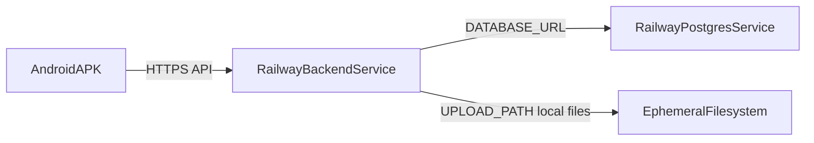

# DEPLOY_RAILWAY_PLAN.md

## Cíl
Připravit backend pro demo/beta nasazení na Railway s PostgreSQL tak, aby Android APK volala veřejné HTTPS API, bez změny business logiky, API kontraktů a Flutter UI.

## 1) Aktuální stav projektu (audit)

### Backend struktura
- Backend je v `backend/` (TypeScript + Express + Prisma).
- Entrypoint serveru: `backend/src/index.ts` (`app.listen(config.port)`).
- Express app + middleware + routy: `backend/src/app.ts`.
- Konfigurace ENV: `backend/src/config.ts`.

### package.json scripts
Současné skripty v `backend/package.json`:
- `build`: `tsc`
- `start`: `node dist/index.js`
- `dev`: `tsx watch src/index.ts`
- `prisma:generate`: `prisma generate`
- `prisma:migrate`: `prisma migrate dev` (vhodné pro lokální dev, ne produkční deploy)
- `prisma:seed`: `prisma db seed`

### Prisma konfigurace
- `backend/prisma/schema.prisma`:
  - `provider = "postgresql"`
  - `url = env("DATABASE_URL")`
- Migrations existují v `backend/prisma/migrations/`.
- Seed existuje v `backend/prisma/seed.ts`.

### ENV proměnné
Využité proměnné (z `backend/src/config.ts` a `.env.example`):
- `PORT`
- `NODE_ENV`
- `DATABASE_URL`
- `JWT_SECRET`
- `UPLOAD_PATH`
- `CORS_ORIGIN`

### Upload složka / fotky
- Fotky se ukládají na filesystem podle `UPLOAD_PATH` (default `./uploads`).
- `backend/src/routes/photos.routes.ts`:
  - upload přes `multer.diskStorage`,
  - následná konverze přes `sharp`,
  - do DB se ukládá metadata + `filePath` (ne binární obsah).
- Statické servírování souborů přes `/uploads` v `backend/src/app.ts`.

### CORS
- `backend/src/app.ts`: `app.use(cors({ origin: config.corsOrigin }))`
- Řízeno ENV `CORS_ORIGIN` (default `*`).

### Seed/migrate flow
- Pro runtime/deploy je vhodný:
  - migrace: `npx prisma migrate deploy`
  - seed: `npx prisma db seed` (jen jednorázově pro demo data)
- V CI už je použitý produkčně správný směr (`migrate deploy`), viz docs.

### Produkční start command
- `npm run start` -> `node dist/index.js`
- kompatibilní s Railway `PORT`.

### Railway PostgreSQL možnost
- Railway managed PostgreSQL je kompatibilní s Prisma přes `DATABASE_URL`.
- App service může používat service reference na Postgres proměnnou:
  - `DATABASE_URL=${{Postgres.DATABASE_URL}}`

### Flutter API_BASE_URL
- `frontend/lib/core/config.dart` používá:
  - `String.fromEnvironment('API_BASE_URL', defaultValue: 'http://localhost:3000')`
- Pro Android release build je potřeba předat veřejnou URL přes:
  - `--dart-define=API_BASE_URL=https://<backend-domain>`

---

## 2) Doporučená Railway architektura (demo/beta)

Jeden Railway project, dvě služby:
1. `backend` (Node/Express service, public domain)
2. `Postgres` (Railway managed PostgreSQL)

Poznámka:
- `backend` služba bude veřejně dostupná přes `https://<backend-domain>`.
- DB komunikace poběží interně přes Railway private network.

---

## 3) Potřebné ENV proměnné na Railway (backend service)

Povinné:
- `NODE_ENV=production`
- `DATABASE_URL=${{Postgres.DATABASE_URL}}`
- `JWT_SECRET=<silny_nahodny_secret_min_32_znaku>`
- `CORS_ORIGIN=*` (pro uzavřenou demo betu dočasně), nebo konkrétní whitelist podle potřeby
- `UPLOAD_PATH=./uploads`

Railway-injected:
- `PORT` nastavuje Railway automaticky (v aplikaci už je respektováno přes `config.port`).

Doporučení:
- Pro externí DB připojení z lokálu používat public DB URL, ne runtime interní URL appky.

---

## 4) Build/start/migration/seed commandy

Pro backend service (`Root Directory = backend`):

- **Build command**  
  `npm ci && npm run build`

- **Start command**  
  `npm run start`

- **Migration command** (spustit při deployi, ideálně pre-deploy)  
  `npx prisma migrate deploy`

- **Seed command** (jen jednorázově pro demo účet/data)  
  `npx prisma db seed`

Poznámka:
- V repozitáři je `prisma` aktuálně v `devDependencies`; pokud by Railway v konkrétním nastavení neinstalovalo dev deps pro krok migrací, je nutná konfigurační úprava deploye nebo přesun `prisma` do `dependencies` (návrh, zatím neimplementovat).

---

## 5) Postup ručního deploye na Railway

1. V Railway vytvořit nový projekt.
2. Připojit GitHub repozitář.
3. Vytvořit service pro backend a nastavit `Root Directory` na `backend`.
4. Přidat Railway PostgreSQL service.
5. V backend service nastavit ENV proměnné (sekce 3).
6. Nastavit build/start commandy (sekce 4).
7. Spustit první deploy.
8. Po deployi spustit migrace:
   - `npx prisma migrate deploy`
9. Volitelně pro demo data spustit seed:
   - `npx prisma db seed`
10. Ověřit veřejné endpointy:
   - `GET https://<backend-domain>/health`
   - `POST https://<backend-domain>/api/auth/login`

---

## 6) Známá omezení Railway free/demo režimu

- Trial/free kredit může být rychle vyčerpán a service může být pozastavena.
- Při uspané službě hrozí cold start (vyšší latence první odpovědi).
- Omezené CPU/RAM může ovlivnit výkon při vyšší beta zátěži.
- U trial/free scénáře mohou být omezené garance dlouhodobé persistence stateful resources bez upgradu.

---

## 7) Rizika uploadů/fotek

- `UPLOAD_PATH=./uploads` je lokální disk instance; při restartu/redeploy může dojít ke ztrátě souborů.
- V DB zůstane `filePath`, ale fyzický soubor může chybět -> rozbitá URL `/uploads/<file>`.
- Upload + sharp konverze přidává I/O a memory tlak (větší riziko na slabších tarifech).

---

## 8) Co vyřešit před ostrým provozem

1. Přesun uploadů z lokálního disku do objektového storage (S3-compatible) s perzistencí.
2. Zpřísnit CORS politiku (konkrétní originy, ne globální `*`).
3. Nastavit bezpečnou správu secretů (`JWT_SECRET` rotace, proces změn).
4. Přidat monitoring/alerting + incident postupy.
5. Definovat backup/restore strategii PostgreSQL.
6. Zavést spolehlivý release proces s migracemi a rollback postupem.

---

## 9) Přesné kroky pro následný Android build s veřejnou API URL

1. Po nasazení backendu získat veřejnou HTTPS URL:
   - `https://<backend-domain>`
2. Vytvořit Android release APK s public API URL:
   - `flutter build apk --release --dart-define=API_BASE_URL=https://<backend-domain>`
3. Nainstalovat APK a ověřit minimálně:
   - login,
   - načtení staveb/pater/ucpávek,
   - sync endpointy,
   - report endpointy.
4. Pokud se objeví CORS blokace, upravit `CORS_ORIGIN` na odpovídající hodnotu.

---

## 10) Návrhy změn kódu/konfigurace (jen návrh, neprovedeno)

- `backend/package.json`:
  - přidat explicitní script `prisma:migrate:deploy` pro konzistentní deploy flow.
- Přidat `railway.toml` pro explicitní build/start/predeploy konfiguraci.
- Migrace uploadů na externí storage adaptér (S3/API) místo lokálního filesystemu.

---

## 11) Vyhodnocení připravenosti projektu na Railway deploy

### Co je připravené
- Backend je buildovatelný a má produkční start script.
- Prisma je nastavena na PostgreSQL přes `DATABASE_URL`.
- Migrace i seed flow existují a jsou použitelné.
- Flutter umí přepnout API URL přes `--dart-define=API_BASE_URL`.

### Co je nutné ohlídat při prvním deployi
- správné nastavení Railway ENV,
- úspěšné provedení `prisma migrate deploy`,
- seed pouze pokud je požadované demo prostředí.

### Verdict
Projekt je **připravený pro Railway demo/beta deploy** s PostgreSQL a veřejným HTTPS API.  
Není ještě připravený pro ostrý provoz bez dořešení persistence uploadů, zpřísnění CORS a provozních/security požadavků.
