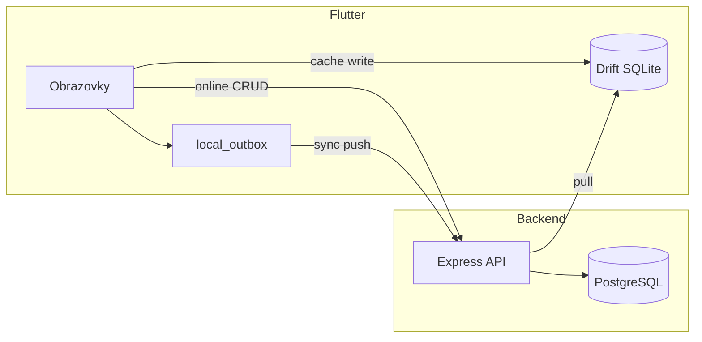

# PROJECT_STATUS.md – audit stavu projektu Ucpávky V1

Datum auditu: **2026-05-28** (finální MVP – interní beta)  
Kontext: lokální PostgreSQL, backend `:3000`. **Beta:** [RELEASE_CHECKLIST.md](RELEASE_CHECKLIST.md), [BETA_TEST_PLAN.md](BETA_TEST_PLAN.md).

### Ověření testů (2026-05-28)

| Příkaz | Výsledek |
|--------|----------|
| `cd backend && npm test` | **8 suites, 52/52 passed** |
| `flutter analyze` | **0 errors**, 2× info (`deprecated_member_use`) |
| `flutter test` (unit/offline + login smoke) | **18/18 passed** |
| `flutter test test/integration/runtime_verification_test.dart` | **12/12** (poslední plný běh; před betou zopakovat) |
| GitHub Actions CI | `.github/workflows/ci.yml` |
| `flutter build windows --release` | **OK** – `Release/ucpavky.exe` (~34 MB) |
| `flutter build apk --release` | **OK** – `app-release.apk` (~58 MB) |

Související dokumenty: [RELEASE_CHECKLIST.md](RELEASE_CHECKLIST.md), [BETA_TEST_PLAN.md](BETA_TEST_PLAN.md), [docs/CI.md](docs/CI.md), [RUNNING.md](RUNNING.md), [KNOWN_ISSUES.md](KNOWN_ISSUES.md), [FRONTEND_STATUS.md](frontend/FRONTEND_STATUS.md).

---

## 0. Finální MVP – interní beta vs. ostré nasazení

### Připraveno pro interní betu

- Kompletní V1 jádro (worker, offline/sync, management export, admin koš)
- Windows release + Android APK sestavitelné a ověřené (PLAT-01, PLAT-02)
- Automatické testy (52 backend + 30 Flutter) + CI
- Dokumentace instalace a [BETA_TEST_PLAN.md](BETA_TEST_PLAN.md) pro 1–2 testery

### Blokuje ostré nasazení

| Blokér | Poznámka |
|--------|----------|
| Hostovaný backend + HTTPS | nyní lokální/LAN HTTP |
| Podpis Windows exe / Android release | SmartScreen, debug signing |
| Mobilní API URL na fyzickém telefonu | LAN IP nebo `dart-define` |
| Provoz (zálohy, monitoring, správa uživatelů) | mimo V1 |
| Koš patra/stavby, sync pull HTTP testy | nižší priorita |

Detail: [RELEASE_CHECKLIST.md](RELEASE_CHECKLIST.md) §2.

Git historie (hlavní milníky):

| Commit | Obsah |
|--------|--------|
| `b5fc9fb` | Initial monorepo (backend + frontend + docs) |
| `cb0cd69` | RUNNING + KNOWN_ISSUES |
| `4d98816` | Lokální PostgreSQL runtime docs + SQL setup |
| `73fe5a7` | Frontend integrace, Windows debug, integrační testy |
| `16eac10` | BE-05 reports/export integrační testy |
| `ebb5fe9` | FE-04 CSV download v ReportsScreen |
| `7804bb6` | FE-05 PDF download v ReportsScreen |
| `1e141e9` | Docs audit po report/export |
| `04532b8` | FE-07 widget smoke login → home |
| `b1cd198` | FE-06 sync retry timer + Drift v3 |
| `5a3e453` | Admin restore UI + `GET /api/seals/trash` |
| (DOC-01) | GitHub Actions CI – backend + Flutter analyze/unit/runtime |
| (PLAT-01) | Windows Release build ověřen |
| (PLAT-02) | Android APK + manifest fix (INTERNET, cleartext) |
| (MVP audit) | RELEASE_CHECKLIST.md, BETA_TEST_PLAN.md |

---

## 1. Co je opravdu funkční

### Infrastruktura a runtime (ověřeno na dev stroji)

| Oblast | Stav | Důkaz |
|--------|------|--------|
| PostgreSQL lokálně (Windows) | OK | `migrate deploy`, `db seed`, port 5432 |
| Backend `npm run dev` | OK | `/health` → 200 |
| Auth login | OK | `worker1/1234` → token + role |
| Prisma schema ↔ DB | OK | „Database schema is up to date“ |
| Flutter Windows debug | OK | `flutter run -d windows --debug` |
| Flutter Windows release | OK | `flutter build windows --release` (PLAT-01) |
| Flutter Android release APK | OK | `flutter build apk --release` (PLAT-02) |
| Flutter integrační testy API | OK | 12/12 v `runtime_verification_test.dart` (+ 18 offline/sync/widget unit testů) |

### Backend API (implementováno + ověřitelné přes HTTP)

| Modul | Endpointy | Poznámka |
|-------|-----------|----------|
| Health | `GET /health` | bez DB |
| Auth | `POST /login`, `POST /logout`, `GET /me` | JWT session, login log |
| Jobs | `GET /jobs`, `GET /by-number/:num`, `POST`, `PATCH /archive` | role checks |
| Floors | `GET/POST /jobs/:id/floors` | management/admin pro POST |
| Seals | CRUD, status, soft delete, restore (admin) | verze, change log |
| Photos | `POST /seals/:id/photos`, DELETE (ne worker) | Sharp → WebP |
| Sync | `POST /push`, `GET /pull` | idempotence `mutation_id` |
| Reports | `work-summary`, `export/csv`, `export/pdf` | management/admin |
| Seals trash/restore | `GET /trash`, `PATCH /:id/restore` | admin only |
| Logs | `GET /activity`, `GET /changes` | management/admin |

### Frontend (UI + reálné API)

| Flow | Obrazovky | API |
|------|-----------|-----|
| Login + session | `LoginScreen`, secure storage | ano |
| Menu dle role | `HomeScreen` | ano (z `/me`) |
| Worker: stavba → patro → seznam | `JobNumberScreen`, `FloorListScreen`, `SealListScreen` | ano |
| Nová / detail ucpávky | `SealFormScreen`, `SealDetailScreen` | ano |
| Sync obrazovka | `SyncScreen` | ano (push/pull volání) |
| Management | `ManagementHomeScreen`, `JobsAdminScreen`, `ReportsScreen`, `LogsScreen` | ano |
| Admin koš | `AdminTrashScreen` (`/trash`) | ano (`GET /api/seals/trash`, restore) |

Router: worker/management → redirect z `/reports` i `/trash`; menu koš jen `admin`.

### Lokální data (Drift)

| Funkce | Stav |
|--------|------|
| SQLite init (tabulky) | OK |
| Cache job/floor při otevření stavby | OK |
| Outbox fronta (`pending` mutace) | OK |
| Sync pull → merge do lokální DB | implementováno v kódu |
| Fotky – lokální fronta upload | implementováno v kódu |

---

## 2. Co je pouze skeleton / neúplná implementace

Jde o kód, který **existuje**, ale není end-to-end hotový nebo není plně ověřený v UI.

| Oblast | Co chybí / je hrubé |
|--------|---------------------|
| **Distribuce release** | Build OK; chybí store signing / installer (Windows SmartScreen, Android release signing) |
| **Android dev API URL** | `localhost` na zařízení ≠ PC – `adb reverse` nebo `--dart-define=API_BASE_URL` |
| **CI/CD** | GitHub Actions hotové (DOC-01); release deploy mimo scope |
| **Backend integrační testy** | Supertest pokrývá auth, seals, sync, reports, trash (BE-01–05); `seal.service.test.js` stále neimportuje service modul |
| **Widget / E2E testy** | FE-07 login→home hotové; širší pump_widget flow (login→seznam ucpávek) chybí |
| **Koš mimo ucpávky** | Patra/stavby – chybí list API + UI |

---

## 3. Co je mock / placeholder

| Položka | Typ | Kde |
|---------|-----|-----|
| **Produkční `lib/` (backend + frontend)** | **Žádný mock** | Vše jde na reálné API / Prisma |
| `backend/__tests__/health.test.js` | Placeholder | `expect(true).toBe(true)` |
| `frontend/test/widget_test.dart` | Stub | odkaz na `login_home_smoke_test.dart` (FE-07) |
| `AppDatabase.forTesting()` | Test-only | in-memory Drift pro testy |
| Hint na loginu „Seed: worker1 / 1234“ | Dev UX | `LoginScreen` |
| `docker-compose.yml` | Volitelná alternativa | na tomto PC se nepoužívá |

---

## 4. Co je napojené na reálné API

Vše přes `Dio` → `http://localhost:3000` ([`frontend/lib/core/config.dart`](frontend/lib/core/config.dart)).



| Klient volá | Backend route |
|-------------|---------------|
| Login / logout / me | `/api/auth/*` |
| Číslo stavby | `/api/jobs/by-number/:num` |
| Patra | `/api/jobs/:jobId/floors` |
| Seznam / detail / formulář ucpávek | `/api/seals/*` |
| Fotky | `/api/seals/:id/photos` |
| Sync | `/api/sync/push`, `/api/sync/pull` |
| Správa staveb | `/api/jobs`, floors POST |
| Soupis / logy | `/api/reports/*`, `/api/logs/*` |

**Nepoužívá API přímo (lokálně):** outbox fronta, sync cursor, device_id (secure storage) – synchronizuje se přes sync endpointy.

---

## 5. Co má testy

| Oblast | Soubor | Co pokrývá |
|--------|--------|------------|
| Backend – smoke API | `backend/__tests__/api.smoke.integration.test.js` | health, login, jobs, floors (BE-01) |
| Backend – auth/role | `backend/__tests__/auth.roles.integration.test.js` | 401/403, management/admin, deaktivace (BE-02) |
| Backend – DB duplicita | `backend/__tests__/seals.duplicate.integration.test.js` | partial unique index (DB-01) |
| Backend – seals HTTP | `backend/__tests__/seals.http.integration.test.js` | duplicita 409, statusy, editace worker (BE-03) |
| Backend – sync push | `backend/__tests__/sync.push.integration.test.js` | idempotence, create, konflikty (BE-04) |
| Backend – reports / export | `backend/__tests__/reports.integration.test.js` | work-summary filtry, CSV/PDF, role 403/200 (BE-05) |
| Backend – admin trash | `backend/__tests__/seals.trash.integration.test.js` | list trash, restore, role 403 |
| Backend – business rules | `backend/__tests__/seal.service.test.js` | kopie logiky statusů (ne importuje service) |
| Frontend – integrace API | `frontend/test/integration/runtime_verification_test.dart` | health, login, job, floors, seals, reports CSV/PDF, trash admin/management, Drift+outbox (12 testů) |
| Frontend – offline/sync unit | `seal_list_offline_test.dart`, `floor_list_offline_test.dart`, `sync_conflict_test.dart`, `seal_detail_offline_test.dart` | Drift read, detail cache, konflikty (9 testů) |
| Frontend – sync retry | `frontend/test/sync_retry_test.dart` | intervaly, pending/failed/conflict/success (FE-06, 7 testů) |
| Frontend – widget smoke | `frontend/test/login_home_smoke_test.dart` | login UI + E2E home (FE-07) |
| Manuální checklist | `docs/04_TESTOVACI_CHECKLIST.md`, `docs/TESTING.md` | scénáře k ručnímu běhu |

**Příkazy ověření:**

```powershell
cd backend && npm test
cd frontend && flutter test test/integration/runtime_verification_test.dart
```

---

## 6. Co testy nemá

| Oblast | Riziko |
|--------|--------|
| Sync pull E2E + verze konflikt přes HTTP | BE-04 push hotové; pull bez dedikovaných HTTP testů |
| Photos upload + permissions | worker vs management |
| Flutter widget testy (login → seznam ucpávek) | FE-07 pokrývá login→home |
| Offline scénář E2E | hlavní hodnota V1 |
| Android build v aktuálním auditu | dříve APK prošlo, nyní neověřeno |

---

## 7. Technické dluhy

### Střední priorita (kvalita / provoz)

1. **Backend testy** – BE-01 až BE-05 + DB-01 + admin trash hotové; `seal.service.test.js` stále netestuje importovaný service modul.
2. **Release distribuce** – nepodepsaný exe, bez MSI/instalátoru.
8. **Web target** – Drift/SQLite FFI na Chrome nefunguje (očekávané).

### Nízká priorita

9. Prisma `package.json#prisma` seed deprecation warning.
10. `flutter analyze` – 2× info `deprecated_member_use` (`DropdownButtonFormField.value` v `reports_screen.dart`).
11. Docker volitelný – na dev PC nepoužívaný (OK dle rozhodnutí).
12. Chybí `.env` v gitignore ok – je; `backend/.env` lokálně necommitovat.

---

## 8. Nejbezpečnější další implementační krok

**Doporučení:** rozšíření koše (patra/stavby) nebo HTTPS pro produkční mobilní klient.

**Hotovo od posledního auditu:**

- **PLAT-02** – Android APK build, INTERNET + cleartext config, emulátor install ([RUNNING.md](RUNNING.md) §6, [KNOWN_ISSUES.md](KNOWN_ISSUES.md) §6)
- **PLAT-01** – Windows Release build ověřen ([RUNNING.md](RUNNING.md) §5.2, [KNOWN_ISSUES.md](KNOWN_ISSUES.md) §4.1)
- **DOC-01** – GitHub Actions (`.github/workflows/ci.yml`, [docs/CI.md](docs/CI.md))

- **BE-01** – smoke supertest (`ucpavky_test`)
- **BE-02** – auth/role integrační testy (401, 403, `isActive`)
- **BE-03** – seals HTTP (409 duplicita, statusy, worker edit lock)
- **DB-01** – partial unique index `seals_active_number_unique` + integrační test duplicity
- **FE-01** – `SealListScreen` offline fallback z Drift + indikátor
- **FE-02** – `FloorListScreen` offline fallback z Drift + indikátor
- **BE-04** – `POST /api/sync/push` integrační testy
- **FE-03** – SyncScreen konflikty + indikátor v seznamu ucpávek
- **BE-05** – integrační testy `GET /api/reports/work-summary`, export CSV/PDF, filtry a role
- **FE-04** – CSV download v `ReportsScreen` (filtry, uložení souboru, role guard)
- **FE-05** – PDF download v `ReportsScreen` (stejné filtry a UX jako CSV)
- **FE-07** – widget smoke login → home (`login_home_smoke_test.dart`)
- **Offline detail** – `SealDetailScreen` Drift fallback + `seal_detail_offline_test.dart`
- **FE-06** – sync retry timer (`sync_retry_test.dart`, Drift v3)
- **Admin restore UI** – koš + `GET /api/seals/trash`

**Až poté (vyšší dopad):**

1. HTTPS + produkční `API_BASE_URL` pro mobilní klienty.
2. Kódový podpis / installer (Windows/Android store).

---

## 9. MVP – hotové vs. zbývá

### Hotové (V1 jádro)

| Oblast | Stav |
|--------|------|
| Auth + role (worker / management / admin) | API + UI menu + router guard na `/reports` a `/trash` |
| Worker flow: stavba → patro → seznam → formulář | API + Drift cache |
| Offline read: seznam ucpávek, patra a detail | FE-01, FE-02, offline detail |
| Sync push/pull, outbox, konflikty, **automatický retry** | BE-04, FE-03, FE-06 |
| Seals: duplicita, statusy, worker edit lock | BE-03, DB-01 |
| Management: stavby, soupis, **CSV/PDF export** | FE-04, FE-05, BE-05 |
| Admin koš + obnova ucpávek | `AdminTrashScreen`, `GET /api/seals/trash`, `PATCH restore` |
| Backend regrese | BE-01–05, DB-01, admin trash (52 Jest testů) |
| Widget smoke login → home | FE-07 |
| CI na push/PR | DOC-01 – backend + Flutter analyze/unit/runtime |
| Windows Release build | PLAT-01 |
| Android release APK | PLAT-02 |

### Zbývá pro MVP / provoz

| Oblast | Poznámka |
|--------|----------|
| Sync pull HTTP testy | BE-04 pokrývá jen push |
| Photos upload integrační testy | worker vs management |
| Širší widget E2E | login → seznam ucpávek (FE-07 jen login→home) |
| Koš patra/stavby | chybí backend list + UI |
| Android E2E na fyzickém zařízení (LAN) | ruční checklist RUNNING §6.4 |
| HTTPS / produkční API URL pro mobil | mimo aktuální dev scope |
| Windows/Android store signing | mimo V1 |

Kompletní fronta: **[AGENT_ORCHESTRATION.md](AGENT_ORCHESTRATION.md)**.

---

## 10. Tři nejbezpečnější další tasky

| # | Task | Proč |
|---|------|------|
| 1 | Rozšíření koše (patra/stavby) | až bude backend list endpoint |
| 2 | Sync pull HTTP testy | BE-04 jen push |
| 3 | HTTPS + produkční mobilní API URL | odstranit cleartext config |

---

## Shrnutí jednou větou

**Interní beta je připravená** (Windows/Android klient + lokální/LAN backend); **ostré nasazení** vyžaduje HTTPS, hostovaný API, podpis aplikací a provoz – viz [RELEASE_CHECKLIST.md](RELEASE_CHECKLIST.md).

**Poznámka reports role:** `/api/reports/*` vyžaduje management/admin (`403` pro worker) – odpovídá implementaci.
