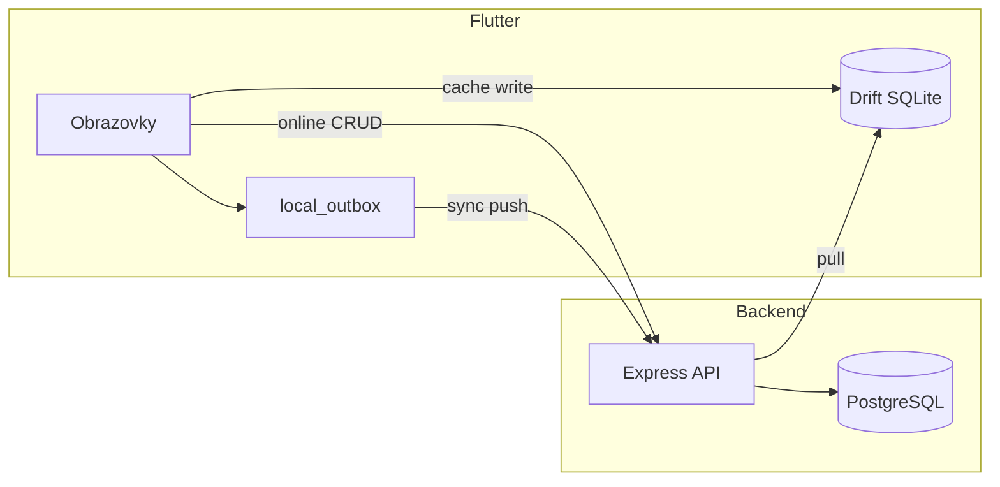

# PROJECT_STATUS.md – audit stavu projektu Ucpávky V1

Datum auditu: **2026-05-27**  
Kontext: po ověření **lokálního PostgreSQL (bez Dockeru)** + **backend runtime** + **Flutter integrace proti `http://localhost:3000`**.

Související dokumenty: [RUNNING.md](RUNNING.md), [KNOWN_ISSUES.md](KNOWN_ISSUES.md), [FRONTEND_STATUS.md](frontend/FRONTEND_STATUS.md), [docs/04_TESTOVACI_CHECKLIST.md](docs/04_TESTOVACI_CHECKLIST.md).

Git historie (hlavní milníky):

| Commit | Obsah |
|--------|--------|
| `b5fc9fb` | Initial monorepo (backend + frontend + docs) |
| `cb0cd69` | RUNNING + KNOWN_ISSUES |
| `4d98816` | Lokální PostgreSQL runtime docs + SQL setup |
| `73fe5a7` | Frontend integrace, Windows debug, integrační testy |

---

## 1. Co je opravdu funkční

### Infrastruktura a runtime (ověřeno na dev stroji)

| Oblast | Stav | Důkaz |
|--------|------|--------|
| PostgreSQL lokálně (Windows) | OK | `migrate deploy`, `db seed`, port 5432 |
| Backend `npm run dev` | OK | `/health` → 200 |
| Auth login | OK | `worker1/1234` → token + role |
| Prisma schema ↔ DB | OK | „Database schema is up to date“ |
| Flutter Windows debug | OK | `flutter run -d windows --debug` |
| Flutter integrační testy API | OK | 6/6 v `runtime_verification_test.dart` |

### Backend API (implementováno + ověřitelné přes HTTP)

| Modul | Endpointy | Poznámka |
|-------|-----------|----------|
| Health | `GET /health` | bez DB |
| Auth | `POST /login`, `POST /logout`, `GET /me` | JWT session, login log |
| Jobs | `GET /jobs`, `GET /by-number/:num`, `POST`, `PATCH /archive` | role checks |
| Floors | `GET/POST /jobs/:id/floors` | management/admin pro POST |
| Seals | CRUD, status, soft delete, restore (admin) | verze, change log |
| Photos | `POST /seals/:id/photos`, DELETE (ne worker) | Sharp → WebP |
| Sync | `POST /push`, `GET /pull` | idempotence `mutation_id` |
| Reports | `work-summary`, `export/csv`, `export/pdf` | management/admin |
| Logs | `GET /activity`, `GET /changes` | management/admin |

### Frontend (UI + reálné API)

| Flow | Obrazovky | API |
|------|-----------|-----|
| Login + session | `LoginScreen`, secure storage | ano |
| Menu dle role | `HomeScreen` | ano (z `/me`) |
| Worker: stavba → patro → seznam | `JobNumberScreen`, `FloorListScreen`, `SealListScreen` | ano |
| Nová / detail ucpávky | `SealFormScreen`, `SealDetailScreen` | ano |
| Sync obrazovka | `SyncScreen` | ano (push/pull volání) |
| Management | `ManagementHomeScreen`, `JobsAdminScreen`, `ReportsScreen`, `LogsScreen` | ano |

### Lokální data (Drift)

| Funkce | Stav |
|--------|------|
| SQLite init (tabulky) | OK |
| Cache job/floor při otevření stavby | OK |
| Outbox fronta (`pending` mutace) | OK |
| Sync pull → merge do lokální DB | implementováno v kódu |
| Fotky – lokální fronta upload | implementováno v kódu |

---

## 2. Co je pouze skeleton / neúplná implementace

Jde o kód, který **existuje**, ale není end-to-end hotový nebo není plně ověřený v UI.

| Oblast | Co chybí / je hrubé |
|--------|---------------------|
| **Offline-first čtení** | Seznamy ucpávek/pater čtou primárně z API; při výpadku sítě UI nepadá na Drift |
| **Sync konflikty** | Backend + outbox `conflict` stav; **chybí obrazovka řešení** pro worker/management |
| **Export CSV v UI** | `ReportsScreen` jen SnackBar s URL, bez stažení souboru s auth headerem |
| **Admin obnova** | API `PATCH /seals/:id/restore` existuje; **ve Flutter UI není** |
| **Retry sync** | V `SyncService` je `nextRetryAt`, ale **bez periodického scheduleru** dle docs (30s/2min/5min) |
| **Windows Release build** | Debug build OK; Release `flutter build windows` může selhat na INSTALL |
| **CI/CD** | Žádný pipeline v repu |
| **Backend integrační testy** | Jen 2 unit „logiky“ v Jest, žádný supertest proti Express |
| **Widget / E2E testy** | Placeholder testy, žádný pump_widget flow |

---

## 3. Co je mock / placeholder

| Položka | Typ | Kde |
|---------|-----|-----|
| **Produkční `lib/` (backend + frontend)** | **Žádný mock** | Vše jde na reálné API / Prisma |
| `backend/__tests__/health.test.js` | Placeholder | `expect(true).toBe(true)` |
| `frontend/test/widget_test.dart` | Placeholder | stejné |
| `AppDatabase.forTesting()` | Test-only | in-memory Drift pro testy |
| Hint na loginu „Seed: worker1 / 1234“ | Dev UX | `LoginScreen` |
| `ReportsScreen` „Export CSV“ | Placeholder UX | ukáže URL, nestáhne soubor |
| `docker-compose.yml` | Volitelná alternativa | na tomto PC se nepoužívá |

---

## 4. Co je napojené na reálné API

Vše přes `Dio` → `http://localhost:3000` ([`frontend/lib/core/config.dart`](frontend/lib/core/config.dart)).



| Klient volá | Backend route |
|-------------|---------------|
| Login / logout / me | `/api/auth/*` |
| Číslo stavby | `/api/jobs/by-number/:num` |
| Patra | `/api/jobs/:jobId/floors` |
| Seznam / detail / formulář ucpávek | `/api/seals/*` |
| Fotky | `/api/seals/:id/photos` |
| Sync | `/api/sync/push`, `/api/sync/pull` |
| Správa staveb | `/api/jobs`, floors POST |
| Soupis / logy | `/api/reports/*`, `/api/logs/*` |

**Nepoužívá API přímo (lokálně):** outbox fronta, sync cursor, device_id (secure storage) – synchronizuje se přes sync endpointy.

---

## 5. Co má testy

| Oblast | Soubor | Co pokrývá |
|--------|--------|------------|
| Backend – smoke API | `backend/__tests__/api.smoke.integration.test.js` | health, login, jobs, floors (BE-01) |
| Backend – auth/role | `backend/__tests__/auth.roles.integration.test.js` | 401/403, management/admin, deaktivace (BE-02) |
| Backend – DB duplicita | `backend/__tests__/seals.duplicate.integration.test.js` | partial unique index (DB-01) |
| Backend – seals HTTP | `backend/__tests__/seals.http.integration.test.js` | duplicita 409, statusy, editace worker (BE-03) |
| Backend – sync push | `backend/__tests__/sync.push.integration.test.js` | idempotence, create, konflikty (BE-04) |
| Backend – business rules | `backend/__tests__/seal.service.test.js` | kopie logiky statusů (ne importuje service) |
| Frontend – integrace API | `frontend/test/integration/runtime_verification_test.dart` | health, login, job, floors, seals, Drift+outbox |
| Frontend – placeholder | `frontend/test/widget_test.dart` | trivial pass |
| Manuální checklist | `docs/04_TESTOVACI_CHECKLIST.md`, `docs/TESTING.md` | scénáře k ručnímu běhu |

**Příkazy ověření:**

```powershell
cd backend && npm test
cd frontend && flutter test test/integration/runtime_verification_test.dart
```

---

## 6. Co testy nemá

| Oblast | Riziko |
|--------|--------|
| Sync pull E2E + verze konflikt přes HTTP | BE-04 push hotové; pull bez dedikovaných testů |
| Photos upload + permissions | worker vs management |
| Reports PDF/CSV | exporty |
| Flutter widget testy (login → seznam) | UI regrese |
| Offline scénář E2E | hlavní hodnota V1 |
| Android build v aktuálním auditu | dříve APK prošlo, nyní neověřeno |

---

## 7. Technické dluhy

### Vysoká priorita (data / integrita)

1. **Sync konflikty** – backend vrací `conflict`, frontend nemá UI pro rozhodnutí; auto-merge se neděje (správně dle spec), ale worker nevidí jasný postup.
2. **Offline read path** – seznam ucpávek (FE-01) a patra (FE-02) hotové; detail ucpávky stále primárně API.

### Střední priorita (kvalita / provoz)

4. **Backend testy** – BE-01 až BE-04 + DB-01 hotové; `seal.service.test.js` stále netestuje importovaný service modul; BE-05+ chybí.
5. **Reports CSV** – nestažitelné z UI (jen URL v SnackBar).
6. **Sync retry intervaly** – dokumentováno v SYNC.md, v kódu chybí centrální timer (jen manuální sync + login sync).
7. **Windows Release build** – INSTALL krok může selhat; Debug je OK.
8. **Web target** – Drift/SQLite FFI na Chrome nefunguje (očekávané).

### Nízká priorita

9. Prisma `package.json#prisma` seed deprecation warning.
10. `flutter analyze` – 1× info `prefer_const_constructors`.
11. Docker volitelný – na dev PC nepoužívaný (OK dle rozhodnutí).
12. Chybí `.env` v gitignore ok – je; `backend/.env` lokálně necommitovat.

---

## 8. Nejbezpečnější další implementační krok

**Doporučení:** **FE-03** (sync conflict UI) nebo **BE-05** (reports smoke).

**Hotovo od posledního auditu:**

- **BE-01** – smoke supertest (`ucpavky_test`)
- **BE-02** – auth/role integrační testy (401, 403, `isActive`)
- **BE-03** – seals HTTP (409 duplicita, statusy, worker edit lock)
- **DB-01** – partial unique index `seals_active_number_unique` + integrační test duplicity
- **FE-01** – `SealListScreen` offline fallback z Drift + indikátor
- **FE-02** – `FloorListScreen` offline fallback z Drift + indikátor
- **BE-04** – `POST /api/sync/push` integrační testy

**Až poté (vyšší dopad):**

1. UI pro sync konflikty (FE-03).
2. Offline detail ucpávky.

---

## 9. Tři navržené malé tasky (pořadí podle rizika)

Kompletní fronta, paralelizace a pravidla pro agenty: **[AGENT_ORCHESTRATION.md](AGENT_ORCHESTRATION.md)** (task ID **BE-01**, **DB-01**, **FE-01** …).

### Task A – Backend smoke testy → **BE-01** (hotovo)

**Cíl:** `supertest` proti `createApp()` s test DB: health, login, job by-number, floors, seals list.

**Rozsah:** pouze `backend/__tests__/`, případně `jest.setup` s test `DATABASE_URL`.

**Nesahej na:** Flutter, sync algoritmus, schema změny.

**Ověření:** `npm test` zelené; selhání login bez seed → jasný fail.

**Riziko:** nízké | **Přínos:** vysoký (regrese)

---

### Task B – Partial unique index → **DB-01** (hotovo)

Migrace `20250528000000_seals_active_number_unique`, testy v `seals.duplicate.integration.test.js`.

---

### Task C – Offline fallback seznamu ucpávek (střední riziko) → **FE-01**

**Cíl:** `SealListScreen` (případně `FloorListScreen`) – při síťové chybě načíst data z Drift místo prázdné chyby.

**Rozsah:** 1–2 soubory ve `frontend/lib/features/`, bez refaktoru sync service.

**Nesahej na:** nové API, konfliktní UI, reports.

**Ověření:** vypnout síť → otevřít dříve načtenou stavbu → seznam čísel viditelný; online stále API first.

**Riziko:** střední (UX edge cases) | **Přínos:** přímá hodnota pro workery v terénu

---

## Shrnutí jednou větou

**Projekt má funkční backend včetně sync push testů a Flutter worker flow s offline cache; chybí sync conflict UI a offline detail – další krok FE-03 nebo BE-05.**
