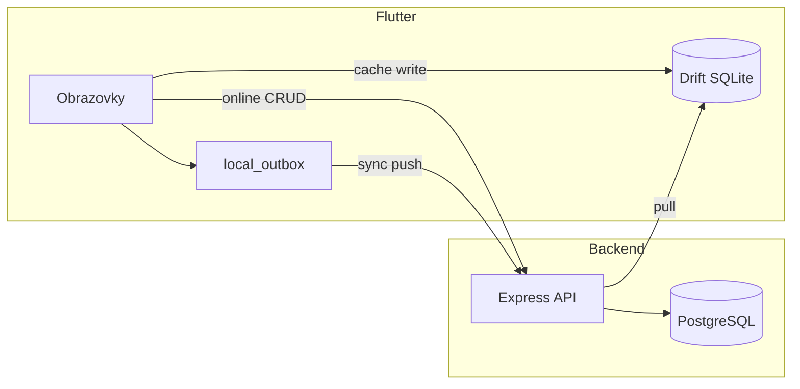

# PROJECT_STATUS.md – audit stavu projektu Ucpávky V1

Datum auditu: **2026-05-27** (kontrolní audit po vlně report/export: BE-05, FE-04, FE-05)  
Kontext: lokální PostgreSQL (bez Dockeru), backend `:3000`, Flutter integrace proti `http://localhost:3000`.

### Ověření testů (2026-05-27)

| Příkaz | Výsledek |
|--------|----------|
| `cd backend && npm test` | **7 suites, 48 passed** (`ucpavky_test`) |
| `flutter test test/integration/runtime_verification_test.dart` | **10/10 passed** (vč. CSV/PDF export, role 403) |
| `flutter test test/seal_list_offline_test.dart test/floor_list_offline_test.dart test/sync_conflict_test.dart` | **6/6 passed** |
| `flutter analyze` | **0 errors**, 2× info (`deprecated_member_use` v `reports_screen.dart`) |

Související dokumenty: [RUNNING.md](RUNNING.md), [KNOWN_ISSUES.md](KNOWN_ISSUES.md), [FRONTEND_STATUS.md](frontend/FRONTEND_STATUS.md), [docs/04_TESTOVACI_CHECKLIST.md](docs/04_TESTOVACI_CHECKLIST.md).

Git historie (hlavní milníky):

| Commit | Obsah |
|--------|--------|
| `b5fc9fb` | Initial monorepo (backend + frontend + docs) |
| `cb0cd69` | RUNNING + KNOWN_ISSUES |
| `4d98816` | Lokální PostgreSQL runtime docs + SQL setup |
| `73fe5a7` | Frontend integrace, Windows debug, integrační testy |
| `16eac10` | BE-05 reports/export integrační testy |
| `ebb5fe9` | FE-04 CSV download v ReportsScreen |
| `7804bb6` | FE-05 PDF download v ReportsScreen |

---

## 1. Co je opravdu funkční

### Infrastruktura a runtime (ověřeno na dev stroji)

| Oblast | Stav | Důkaz |
|--------|------|--------|
| PostgreSQL lokálně (Windows) | OK | `migrate deploy`, `db seed`, port 5432 |
| Backend `npm run dev` | OK | `/health` → 200 |
| Auth login | OK | `worker1/1234` → token + role |
| Prisma schema ↔ DB | OK | „Database schema is up to date“ |
| Flutter Windows debug | OK | `flutter run -d windows --debug` |
| Flutter integrační testy API | OK | 10/10 v `runtime_verification_test.dart` (+ 6 offline/sync unit testů) |

### Backend API (implementováno + ověřitelné přes HTTP)

| Modul | Endpointy | Poznámka |
|-------|-----------|----------|
| Health | `GET /health` | bez DB |
| Auth | `POST /login`, `POST /logout`, `GET /me` | JWT session, login log |
| Jobs | `GET /jobs`, `GET /by-number/:num`, `POST`, `PATCH /archive` | role checks |
| Floors | `GET/POST /jobs/:id/floors` | management/admin pro POST |
| Seals | CRUD, status, soft delete, restore (admin) | verze, change log |
| Photos | `POST /seals/:id/photos`, DELETE (ne worker) | Sharp → WebP |
| Sync | `POST /push`, `GET /pull` | idempotence `mutation_id` |
| Reports | `work-summary`, `export/csv`, `export/pdf` | management/admin |
| Logs | `GET /activity`, `GET /changes` | management/admin |

### Frontend (UI + reálné API)

| Flow | Obrazovky | API |
|------|-----------|-----|
| Login + session | `LoginScreen`, secure storage | ano |
| Menu dle role | `HomeScreen` | ano (z `/me`) |
| Worker: stavba → patro → seznam | `JobNumberScreen`, `FloorListScreen`, `SealListScreen` | ano |
| Nová / detail ucpávky | `SealFormScreen`, `SealDetailScreen` | ano |
| Sync obrazovka | `SyncScreen` | ano (push/pull volání) |
| Management | `ManagementHomeScreen`, `JobsAdminScreen`, `ReportsScreen`, `LogsScreen` | ano |

### Lokální data (Drift)

| Funkce | Stav |
|--------|------|
| SQLite init (tabulky) | OK |
| Cache job/floor při otevření stavby | OK |
| Outbox fronta (`pending` mutace) | OK |
| Sync pull → merge do lokální DB | implementováno v kódu |
| Fotky – lokální fronta upload | implementováno v kódu |

---

## 2. Co je pouze skeleton / neúplná implementace

Jde o kód, který **existuje**, ale není end-to-end hotový nebo není plně ověřený v UI.

| Oblast | Co chybí / je hrubé |
|--------|---------------------|
| **Offline-first čtení** | Seznamy ucpávek/pater (FE-01, FE-02) mají Drift fallback; **detail ucpávky** stále jen API |
| **Sync konflikty** | Zobrazení a skrytí v UI hotové (FE-03); automatické slučení záměrně není |
| **Admin obnova** | API `PATCH /seals/:id/restore` existuje; **ve Flutter UI není** |
| **Retry sync** | V `SyncService` je `nextRetryAt`, ale **bez periodického scheduleru** dle docs (30s/2min/5min) |
| **Windows Release build** | Debug build OK; Release `flutter build windows` může selhat na INSTALL |
| **CI/CD** | Žádný pipeline v repu |
| **Backend integrační testy** | Supertest pokrývá auth, seals, sync, reports (BE-01–05); `seal.service.test.js` stále neimportuje service modul |
| **Widget / E2E testy** | Placeholder testy, žádný pump_widget flow |

---

## 3. Co je mock / placeholder

| Položka | Typ | Kde |
|---------|-----|-----|
| **Produkční `lib/` (backend + frontend)** | **Žádný mock** | Vše jde na reálné API / Prisma |
| `backend/__tests__/health.test.js` | Placeholder | `expect(true).toBe(true)` |
| `frontend/test/widget_test.dart` | Placeholder | stejné |
| `AppDatabase.forTesting()` | Test-only | in-memory Drift pro testy |
| Hint na loginu „Seed: worker1 / 1234“ | Dev UX | `LoginScreen` |
| `docker-compose.yml` | Volitelná alternativa | na tomto PC se nepoužívá |

---

## 4. Co je napojené na reálné API

Vše přes `Dio` → `http://localhost:3000` ([`frontend/lib/core/config.dart`](frontend/lib/core/config.dart)).



| Klient volá | Backend route |
|-------------|---------------|
| Login / logout / me | `/api/auth/*` |
| Číslo stavby | `/api/jobs/by-number/:num` |
| Patra | `/api/jobs/:jobId/floors` |
| Seznam / detail / formulář ucpávek | `/api/seals/*` |
| Fotky | `/api/seals/:id/photos` |
| Sync | `/api/sync/push`, `/api/sync/pull` |
| Správa staveb | `/api/jobs`, floors POST |
| Soupis / logy | `/api/reports/*`, `/api/logs/*` |

**Nepoužívá API přímo (lokálně):** outbox fronta, sync cursor, device_id (secure storage) – synchronizuje se přes sync endpointy.

---

## 5. Co má testy

| Oblast | Soubor | Co pokrývá |
|--------|--------|------------|
| Backend – smoke API | `backend/__tests__/api.smoke.integration.test.js` | health, login, jobs, floors (BE-01) |
| Backend – auth/role | `backend/__tests__/auth.roles.integration.test.js` | 401/403, management/admin, deaktivace (BE-02) |
| Backend – DB duplicita | `backend/__tests__/seals.duplicate.integration.test.js` | partial unique index (DB-01) |
| Backend – seals HTTP | `backend/__tests__/seals.http.integration.test.js` | duplicita 409, statusy, editace worker (BE-03) |
| Backend – sync push | `backend/__tests__/sync.push.integration.test.js` | idempotence, create, konflikty (BE-04) |
| Backend – reports / export | `backend/__tests__/reports.integration.test.js` | work-summary filtry, CSV/PDF, role 403/200 (BE-05) |
| Backend – business rules | `backend/__tests__/seal.service.test.js` | kopie logiky statusů (ne importuje service) |
| Frontend – integrace API | `frontend/test/integration/runtime_verification_test.dart` | health, login, job, floors, seals, reports CSV/PDF, role 403, Drift+outbox |
| Frontend – offline/sync unit | `seal_list_offline_test.dart`, `floor_list_offline_test.dart`, `sync_conflict_test.dart` | Drift read, konflikty (6 testů) |
| Frontend – placeholder | `frontend/test/widget_test.dart` | trivial pass |
| Manuální checklist | `docs/04_TESTOVACI_CHECKLIST.md`, `docs/TESTING.md` | scénáře k ručnímu běhu |

**Příkazy ověření:**

```powershell
cd backend && npm test
cd frontend && flutter test test/integration/runtime_verification_test.dart
```

---

## 6. Co testy nemá

| Oblast | Riziko |
|--------|--------|
| Sync pull E2E + verze konflikt přes HTTP | BE-04 push hotové; pull bez dedikovaných HTTP testů |
| Photos upload + permissions | worker vs management |
| Flutter widget testy (login → seznam) | UI regrese |
| Offline scénář E2E | hlavní hodnota V1 |
| Android build v aktuálním auditu | dříve APK prošlo, nyní neověřeno |

---

## 7. Technické dluhy

### Vysoká priorita (data / integrita)

1. **Sync konflikty – UI** – zobrazení a skrytí upozornění hotové (FE-03); automatické slučení záměrně není.
2. **Offline read path** – seznam ucpávek (FE-01) a patra (FE-02) hotové; detail ucpávky stále primárně API.

### Střední priorita (kvalita / provoz)

4. **Backend testy** – BE-01 až BE-05 + DB-01 hotové; `seal.service.test.js` stále netestuje importovaný service modul.
6. **Sync retry intervaly** – dokumentováno v SYNC.md, v kódu chybí centrální timer (jen manuální sync + login sync).
7. **Windows Release build** – INSTALL krok může selhat; Debug je OK.
8. **Web target** – Drift/SQLite FFI na Chrome nefunguje (očekávané).

### Nízká priorita

9. Prisma `package.json#prisma` seed deprecation warning.
10. `flutter analyze` – 2× info `deprecated_member_use` (`DropdownButtonFormField.value` v `reports_screen.dart`).
11. Docker volitelný – na dev PC nepoužívaný (OK dle rozhodnutí).
12. Chybí `.env` v gitignore ok – je; `backend/.env` lokálně necommitovat.

---

## 8. Nejbezpečnější další implementační krok

**Doporučení:** offline detail ucpávky (`SealDetailScreen`) nebo **FE-06** (sync retry timer).

**Hotovo od posledního auditu:**

- **BE-01** – smoke supertest (`ucpavky_test`)
- **BE-02** – auth/role integrační testy (401, 403, `isActive`)
- **BE-03** – seals HTTP (409 duplicita, statusy, worker edit lock)
- **DB-01** – partial unique index `seals_active_number_unique` + integrační test duplicity
- **FE-01** – `SealListScreen` offline fallback z Drift + indikátor
- **FE-02** – `FloorListScreen` offline fallback z Drift + indikátor
- **BE-04** – `POST /api/sync/push` integrační testy
- **FE-03** – SyncScreen konflikty + indikátor v seznamu ucpávek
- **BE-05** – integrační testy `GET /api/reports/work-summary`, export CSV/PDF, filtry a role
- **FE-04** – CSV download v `ReportsScreen` (filtry, uložení souboru, role guard)
- **FE-05** – PDF download v `ReportsScreen` (stejné filtry a UX jako CSV)

**Až poté (vyšší dopad):**

1. Offline detail ucpávky.
2. FE-06 sync retry timer.

---

## 9. MVP – hotové vs. zbývá

### Hotové (V1 jádro)

| Oblast | Stav |
|--------|------|
| Auth + role (worker / management / admin) | API + UI menu + router guard na `/reports` |
| Worker flow: stavba → patro → seznam → formulář | API + Drift cache |
| Offline read: seznam ucpávek a patra | FE-01, FE-02 |
| Sync push/pull, outbox, konflikty (zobrazení) | BE-04, FE-03 |
| Seals: duplicita, statusy, worker edit lock | BE-03, DB-01 |
| Management: stavby, soupis, **CSV/PDF export** | FE-04, FE-05, BE-05 |
| Backend regrese | BE-01–05, DB-01 (48 Jest testů) |

### Zbývá pro MVP / provoz

| Oblast | Poznámka |
|--------|----------|
| Offline read: **detail ucpávky** | `SealDetailScreen` bez Drift fallbacku |
| Sync retry timer | FE-06 – periodický push dle SYNC.md |
| Admin restore v UI | API existuje, obrazovka ne |
| Widget/E2E smoke | FE-07 |
| Sync pull HTTP testy | BE-04 jen push |
| CI/CD, Windows Release, Android re-verify | DOC-01, PLAT-01, PLAT-02 |

Kompletní fronta: **[AGENT_ORCHESTRATION.md](AGENT_ORCHESTRATION.md)**.

---

## 10. Tři nejbezpečnější další tasky

| # | Task | Proč |
|---|------|------|
| 1 | **FE-07** – widget smoke (login → home) | nejnižší riziko, jen `frontend/test/`, žádná business logika |
| 2 | **Offline detail** – `SealDetailScreen` Drift fallback | dokončí offline read path (vzor FE-01), bez změny API |
| 3 | **Admin restore UI** (orchestrace: FE-05 v docs = restore; v gitu PDF = `7804bb6`) | malý scope, existující `PATCH /seals/:id/restore` |

**Sekvenčně ne:** FE-06 (sync timer) paralelně s většími úpravami sync UI.

---

## Shrnutí jednou větou

**Report/export vlna je hotová (BE-05 + FE-04 + FE-05); testy zelené; další nejbezpečnější krok je FE-07 nebo offline detail ucpávky.**

**Poznámka reports role:** `/api/reports/*` vyžaduje management/admin (`403` pro worker) – odpovídá implementaci.
