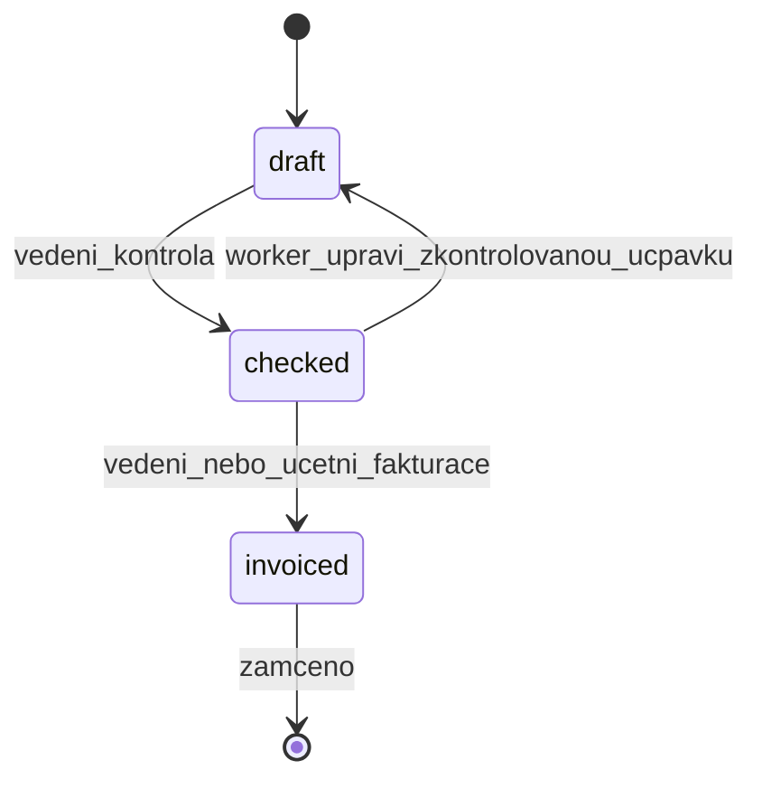

# UNIFAST / Ucpávky – sjednocený změnový plán V1.1

## Účel dokumentu

Tento dokument sjednocuje požadované změny pro další vývoj aplikace **Ucpávky / Unifast**.

Obsahuje:
- změny rolí a oprávnění,
- PIN logiku,
- pravidla editace ucpávek,
- prioritu fotek,
- synchronizaci a offline pravidla,
- soukromé zprávy,
- interní poznámku u ucpávky,
- moje zakázky,
- rozdělení logů,
- ceník,
- price snapshot,
- soupis prací,
- exporty,
- rizika,
- doporučené pořadí implementace.

Dokument je **plán/specifikace**.  
Nemá automaticky měnit kód, backend, frontend, databázi ani API.

---

# 0. Nejdůležitější změna priorit

## PHOTO-01 je první priorita

Než se začne implementovat:

- nové role,
- účetní,
- změny workflow,
- ceník,
- price snapshot,
- soupis prací,
- exporty,
- moje zakázky,
- zprávy,
- logy,
- UI redesign,

musí být stabilně vyřešené:

```txt
PHOTO-01 – stabilní ukládání a synchronizace fotek
```

## Důvod

Fotodokumentace je provozní základ aplikace.

Bez funkčních fotek:
- ucpávka nemá dostatečný důkazní materiál,
- vedení nemůže práci spolehlivě zkontrolovat,
- účetní / vedení nemají jistotu pro fakturaci,
- soupis prací může být formálně správný, ale provozně slabý,
- offline režim nedává smysl, pokud fotky mizí nebo se neodesílají.

---

# 1. PHOTO-01 – stabilní fotky

## Cíl

Fotky musí fungovat online i offline.

## Požadované chování

1. Po vyfocení nebo výběru z galerie se fotka uloží lokálně.
2. Fotka se zobrazí v detailu ucpávky.
3. Fotka zůstane dostupná i po restartu aplikace.
4. Offline fotka se označí jako pending upload.
5. Při synchronizaci se fotka nahraje na backend.
6. Po úspěšném uploadu se označí jako uploaded/synced.
7. Pokud upload selže, musí být označena jako failed.
8. SyncScreen musí jasně ukazovat neodeslané fotky.
9. Uživatel musí vidět stav fotky: čeká na upload / nahraná / chyba uploadu.
10. Fotky nesmí mizet po pullu, refreshi seznamu ani restartu.
11. Fotky musí být navázané na správnou ucpávku.
12. Backend musí uložit fotku ke správné ucpávce.
13. Detail ucpávky musí fotku zobrazit i po znovuotevření.

## Dotčené oblasti

- `frontend/lib/features/seals/seal_form_screen.dart`
- `frontend/lib/features/seals/seal_detail_screen.dart`
- `frontend/lib/features/sync/sync_service.dart`
- `frontend/lib/features/sync/sync_screen.dart`
- `frontend/lib/database/database.dart`
- `backend/src/routes/photos.routes.ts`
- backend upload storage
- Android permissions
- iOS permissions, pokud je iOS relevantní

## Testovací scénář

1. Vytvořit ucpávku offline.
2. Přidat fotku.
3. Restartovat aplikaci.
4. Ověřit, že fotka zůstala.
5. Zapnout backend.
6. Spustit sync.
7. Ověřit, že fotka je uploadnutá.
8. Ověřit detail po refreshi.
9. Ověřit SyncScreen.
10. Ověřit retry failed fotky.

Doporučený commit:

```txt
fix: stabilize seal photo persistence and sync
```

### Implementační stav (2026-06-03)

- **Hotovo** — persist do `appDocuments/seal_photos`, mapování server photo ID, status pending/done/failed v detailu, neodeslané fotky v SyncScreen, pull hydrate `local_photos`.
- **Riziko:** staré fotky uložené v temp před upgradem mohou chybět (soubor smazán OS); Railway ephemeral disk pro backend uploady.


---

# 2. SYNC-01 – stabilizace synchronizace

### Implementační stav (2026-06-03)

- **Hotovo** — list cache respektuje sync flags; merge deduplikuje podle sealNumber; remap local seal ID po pushi; outbox queue count v SyncScreen; backend `operation: status`.
- **Device strategy (S4):** outbox filtrovaný podle `userId` (T6); fotky via seal; logout nečistí frontu — rozhodnutí o sdíleném tabletu odloženo.

## Problémy k řešení

- Po „úspěšné“ synchronizaci ucpávka může zmizet ze seznamu.
- Pull může přepsat lokální `isSynced` / `syncConflict`.
- Počet čekajících položek může ukazovat víc než reálně synchronizovatelné položky.
- Pending sync / fotky se můžou zobrazovat všem uživatelům na stejném zařízení.
- Status změny nemusí být v offline outboxu.
- `operation: status` může existovat ve schématu, ale nemusí být implementované v backend `processMutation`.
- Push loop musí správně zpracovat všechny pending mutace.

## Priority sync oprav

1. Pull nesmí přepisovat lokální konflikty a pending změny.
2. Po úspěšném pushi nesmí položka zmizet ze seznamu.
3. Push musí korektně zpracovat všechny výsledky.
4. Počet čekajících položek musí odpovídat realitě.
5. Fotky nesmí zůstat pending kvůli špatnému stavu ucpávky.
6. Multi-user na jednom zařízení vyžaduje jasnou strategii.

## Otevřené rozhodnutí

Je zařízení:
- osobní telefon pracovníka,
- nebo sdílený firemní tablet?

Podle toho se musí rozhodnout, zda se outbox/fotky izolují podle `userId`, nebo se při logoutu čistí.

---

# 3. Role a oprávnění

## Cílové role

```txt
worker
vedeni
ucetni
admin
```

| Role | Význam |
|---|---|
| worker | pracovník v terénu, zapisuje a upravuje ucpávky |
| vedeni | hlavní běžná správa systému |
| ucetni | soupisy, exporty, fakturace |
| admin | Super Admin / nouzový účet |

## Admin jako Super Admin

Admin se nemá používat pro běžnou práci.

Admin je:
- nouzový účet,
- technická správa,
- obnova dat,
- řešení havárií,
- zásahy mimo běžné oprávnění.

Běžnou správu má mít role `vedeni`.

---

# 4. Stav ucpávky – důležité rozhodnutí

## Nezavádět nové stavy

Nezavádět:
- `ready_for_check`
- `needs_fix`

Nezavádět workflow:
- vedení vrací workerovi,
- worker oprava,
- komentáře vedení zpět workerovi jako součást workflow ucpávky.

## Zachované jednoduché stavy

```txt
draft
checked
invoiced
```

## Doporučené workflow



## Pravidla

| Stav | Worker | Vedení | Účetní | Admin |
|---|---|---|---|---|
| draft | může upravit | může upravit | čte/exportuje dle oprávnění | vše |
| checked | může upravit, ale stav se vrátí na draft | může upravit | může fakturačně pracovat | vše |
| invoiced | nesmí upravit | jen zvláštní oprávnění / odemknutí | čte/exportuje | nouzově |

`invoiced = zamčeno`.

Worker fakturovanou ucpávku neupravuje.


---

# 5. Worker pravidla

## Worker může upravovat jakoukoliv ucpávku

Worker může upravovat:
- vlastní ucpávku,
- cizí ucpávku,
- ucpávku jiného workera.

## Podmínky

- `createdBy` zůstává původní autor.
- `updatedBy` je poslední editor.
- `updatedAt` se aktualizuje.
- Každá změna se zapisuje do audit/change logu.
- Worker nesmí upravit `invoiced`.
- Pokud worker upraví `checked`, status se automaticky vrátí na `draft`.

---

# 6. PIN logika

## Po prvním přihlášení změna PINu

Každý nový účet musí po prvním přihlášení změnit PIN.

Dokud PIN nezmění, nesmí pokračovat do aplikace.

## Změna PINu v profilu

Každý uživatel si může kdykoliv změnit PIN.

Doporučené údaje:
- starý PIN,
- nový PIN,
- potvrzení nového PINu.

## Reset PINu vedením

Pokud vedení resetuje PIN uživatele:

```txt
mustChangePin = true
```

---

# 7. Interní poznámka u ucpávky

## Cíl

Worker může při ukládání ucpávky doplnit vlastní interní poznámku z terénu.

## Není to

- komentář vedení workerovi,
- chat,
- stav vráceno k opravě,
- úkol.

## Je to

Volitelné textové pole přímo u ucpávky.

## Příklady

```txt
Přístup pouze ze šachty.
Prostup větší než v projektu.
Použit náhradní materiál.
Fotka pořízena až po dokončení SDK.
```

## Pravidla

- zobrazuje se v detailu ucpávky,
- může být součástí exportu,
- změny se auditují,
- worker ji může vyplnit při ukládání,
- vedení ji vidí,
- účetní ji může vidět v soupisu/exportu, pokud je to potřeba.

---

# 8. Soukromé zprávy

## Cíl

Samostatná interní komunikace v aplikaci.

## Komunikace

- worker ↔ vedení,
- vedení ↔ účetní,
- vedení ↔ worker,
- případně vedení ↔ vedení.

## V1 rozsah

- textová zpráva,
- odesílatel,
- příjemce,
- datum a čas,
- přečteno/nepřečteno.

## V2 rozšíření

- přílohy,
- fotky,
- odkaz na stavbu,
- odkaz na ucpávku,
- push notifikace.

Soukromé zprávy nejsou komentáře k ucpávce.

---

# 9. Moje zakázky

## Cíl

Worker vidí seznam zakázek, kterých se účastní.

## Účast vzniká

- vytvořením ucpávky,
- editací ucpávky,
- ručním přiřazením vedením.

## Doporučený model

```prisma
model JobParticipant {
  id             String   @id @default(uuid())
  jobId          String
  userId         String
  roleOnJob      String
  assignedById   String?
  createdAt      DateTime @default(now())
  lastActivityAt DateTime @default(now())

  @@unique([jobId, userId])
  @@map("job_participants")
}
```

## API

- `GET /api/jobs/my`
- `POST /api/jobs/:jobId/participants`
- `DELETE /api/jobs/:jobId/participants/:userId`

## UX

Worker home:
1. Moje zakázky
2. Poslední zakázky
3. Zadat číslo stavby


---

# 10. Duplicitní číslo ucpávky

### Implementační stav (2026-06-03)

- **Hotovo** — hláška dle specifikace, SyncScreen duplicate summary, oprava čísla v konfliktu (commit `7cd0891`).

## Chování

Při duplicitě čísla zobrazit jasnou chybu:

```txt
Číslo ucpávky už na tomto patře existuje.
Změň číslo ucpávky a oprav štítek.
```

## Online

- API vrací 409.
- UI zobrazí konkrétní chybu.
- Worker může číslo rovnou opravit.

## Offline sync konflikt

- konflikt musí ukázat konkrétní ucpávku,
- ukázat původní číslo,
- ukázat konfliktní číslo,
- umožnit opravu,
- nesmí se tiše ignorovat.

---

# 11. Offline číslování

## Chování

Offline vytvořená ucpávka může mít dočasné číslo:

```txt
TEMP-001
```

Po syncu server přidělí finální číslo:

```txt
UC-2026-0145
```

## Pokud se číslo změní

Zobrazit warning:

```txt
Číslo ucpávky se změnilo.
Oprav štítek a znovu vyfoť.
```

## Riziko

Toto je zásah do sync logiky.

Implementovat až po:
1. opravě syncu,
2. opravě fotek,
3. stabilním duplicate conflict handlingu.

---

# 12. Prostupy

## Cíl

Zjednodušit zadávání více prostupů.

## Pravidla

- systém a materiály se vybírají na úrovni hlavní ucpávky,
- další prostupy už nemusí mít vlastní výběr materiálů,
- další prostupy řeší hlavně:
  - typ,
  - rozměr,
  - počet,
  - izolaci,
  - poznámku.

## Dočasná kompatibilita

Pokud současné API stále vyžaduje materiály na každém prostupu, frontend může interně zkopírovat materiály z hlavní ucpávky do všech prostupů.

---

# 13. Exporty

### Implementační stav (2026-06-03)

- **Hotovo** — filtry pracovník/zakázka/patro/status/období/systém/typ prostupu, save dialog (`file_picker`), CSV/PDF (commit `687be3d`).

## Požadavky

Exporty musí umožnit filtrovat podle:
- pracovníka / jména,
- zakázky,
- patra,
- statusu,
- období,
- systému,
- typu prostupu.

## Uložení souboru

Uživatel má mít možnost zvolit vlastní cestu uložení exportu tam, kde to platforma dovolí.

## Výstupy

- CSV,
- PDF,
- později XLSX, pokud bude potřeba.


---

# 14. REPORT-01 – Soupis prací

## Cíl

Přidat funkci pro generování soupisu prací podle firemního vzoru.

Soupis prací slouží jako podklad pro:
- kontrolu provedených prací,
- fakturaci,
- export pro vedení,
- export pro účetní,
- přehled práce workerů.

## Přístup

Soupis prací má být dostupný všem rolím:
- worker,
- vedeni,
- ucetni,
- admin / Super Admin.

## Rozdíl podle rolí

### Worker

Worker vidí primárně svoje položky.

Může filtrovat:
- podle stavby,
- podle období,
- podle stavu,
- podle patra,
- podle vlastního jména.

### Vedení

Vedení vidí všechny položky.

Může filtrovat:
- podle stavby,
- podle pracovníka,
- podle patra,
- podle období,
- podle statusu,
- podle systému.

### Účetní

Účetní má přístup hlavně k soupisům, exportům a fakturaci.

Může:
- zobrazit soupis,
- filtrovat data,
- exportovat PDF,
- exportovat CSV.

Nemůže:
- měnit technická data,
- měnit fotky,
- upravovat prostupy,
- spravovat stavby/patra/uživatele.

### Admin / Super Admin

Vidí vše, ale není určen pro běžnou práci.

## Filtry soupisu

- stavba / zakázka,
- pracovník / provedl,
- období od–do,
- měsíc,
- status ucpávky,
- patro,
- systém,
- typ prostupu.

## Výstupy

- náhled v aplikaci,
- export PDF,
- export CSV,
- později XLSX.

## Struktura podle firemního PDF

### Hlavička

- Soupis prací – číslo soupisu,
- jméno / pracovník / zpracoval,
- číslo nebo název zakázky,
- název stavby,
- období,
- fakturováno bez DPH:
  - od zahájení do konce předchozího období,
  - ve sledovaném měsíci,
  - od zahájení do konce sledovaného měsíce.

### Tabulka položek

- Podlaží,
- Prostup,
- Systém,
- Katalog ID,
- Typ,
- Rozměr,
- Počet,
- Izolace,
- Umístění v PÚ,
- Provedl,
- Jednotková cena,
- Cena celkem.

### Součty

- Cena za podlaží,
- Cena za sledované období,
- Cena celkem bez DPH.

## Pravidla

- Položky se seskupují podle podlaží.
- Každý prostup může být samostatný řádek.
- Materiály se zobrazí v „Katalog ID“.
- Cena celkem = jednotková cena × počet.
- Soupis používá price snapshot.
- Soupis nesmí přepočítávat staré položky podle aktuálního ceníku.
- Do fakturačního soupisu nesmí jít neodeslané offline položky bez varování.


---

# 15. PRICE-01 – Ceník a oceňování ucpávek

## Cíl

Přidat modul ceníku pro automatické ocenění ucpávek a tvorbu soupisu prací.

## Kategorie ceníku

Minimálně:
- EL. V.
- OC / nehořlavé potrubí,
- OC s hořlavou izolací,
- VZT,
- Konstrukční spára,
- PVC / hořlavé potrubí,
- větší rozměrové rozsahy VZT/PVC.

## Ceník musí být verzovaný

Příklad:
- `priceListVersion = 2026-06`
- `validFrom`
- `validTo`
- `active`

## Položka ceníku

Každá položka má obsahovat:
- category,
- type,
- sizeLabel,
- minSize,
- maxSize,
- unit,
- priceWithMaterial,
- priceWithoutMaterial,
- currency,
- note,
- active.

## Jednotky

- kus,
- bm,
- m².

## Cena s materiálem / bez materiálu

Aplikace musí rozlišovat:
- cenu s materiálem,
- cenu bez materiálu / práce.

---

# 16. Price snapshot – kriticky důležité

## Nejdůležitější pravidlo

Cena použitá u konkrétní ucpávky / položky soupisu se musí uložit v okamžiku ocenění jako snapshot.

Nestačí pouze odkazovat na aktuální ceník.

## Důvod

Pokud se později změní ceník, staré ucpávky, staré soupisy prací a již fakturované položky se nesmí přepočítat podle nových cen.

## Každá oceněná položka musí mít uložené minimálně

- unitPrice,
- quantity,
- totalPrice,
- currency,
- priceListVersion,
- priceListItemId,
- priceMode,
- pricedAt,
- pricedByUserId,
- priceSource,
- priceOverrideReason.

## priceMode

- with_material,
- without_material.

## priceSource

- automatic,
- manual_override.

## Pravidla

1. Při vytvoření nebo úpravě ucpávky aplikace najde odpovídající položku v aktivním ceníku.
2. Do ucpávky nebo seal entry se uloží snapshot ceny.
3. Soupis prací používá uložený snapshot, ne aktuální cenu z ceníku.
4. Pokud vedení později změní ceník, staré fakturované nebo zkontrolované položky zůstávají cenově stejné.
5. Pokud je potřeba přecenit již existující položku, musí to být vědomá akce vedení/admina.
6. Ruční změna ceny musí být auditovaná.
7. Worker nesmí svévolně měnit jednotkovou cenu.
8. Účetní může cenu vidět a exportovat.
9. U fakturovaných položek se cena nesmí měnit bez speciálního oprávnění.
10. V exportu musí být jasné, z jaké ceny byla položka počítána.

## Příklad

Ucpávka:
- typ: Elektrické vedení,
- rozměr: Ø 20,
- počet: 2,
- jednotková cena při uložení: 130 Kč,
- celkem: 260 Kč,
- ceník: 2026-06.

Pokud se za měsíc cena Ø 20 změní na 150 Kč, stará položka stále zůstane:
- jednotková cena: 130 Kč,
- celkem: 260 Kč.

## Riziko bez price snapshotu

Bez snapshotu by se staré soupisy prací po změně ceníku mohly přepočítat jinak než původně.

To by způsobilo nesoulad s:
- fakturací,
- účetnictvím,
- odsouhlasenými výkazy,
- historickými soupisy prací.


---

# 17. Správa ceníku

## Vedení

Může:
- zobrazit ceník,
- založit novou verzi ceníku,
- upravit položku,
- deaktivovat položku,
- přidat položku,
- schválit novou verzi ceníku.

## Účetní

Může:
- číst ceník,
- používat ceník v exportech,
- kontrolovat ocenění položek.

Neměla by běžně měnit technické položky ceníku bez dohody s vedením.

## Worker

Worker nemusí vidět celý ceník.

Při zadávání ucpávky aplikace automaticky přiřadí cenu podle:
- typu prostupu,
- rozměru,
- izolace,
- materiálu/systému,
- jednotky.

Worker nesmí svévolně měnit cenu.

## Admin / Super Admin

Nouzová správa ceníku a opravy.

---

# 18. Pokud aplikace nenajde cenu

Pokud aplikace nenajde cenu v ceníku:

- zobrazit warning,
- označit položku jako „bez ceny“,
- povolit ruční cenu pouze vedení/adminovi,
- worker nesmí libovolně měnit cenu,
- položka bez ceny nesmí být fakturována bez kontroly.

---

# 19. Logy

## Rozdělení logů

Nerozbíjet vše do jednoho logu.

Minimálně rozlišit:
- audit/change log,
- auth log,
- sync log,
- error log,
- photo log,
- admin log.

## UI

LogsScreen ideálně jako záložky:
- Aktivita,
- Změny,
- Přihlášení,
- Synchronizace,
- Chyby,
- Fotky,
- Admin zásahy.

## Filtry

- uživatel,
- zakázka,
- patro,
- ucpávka,
- datum od–do,
- typ akce.

---

# 20. Doporučené pořadí implementace

## Fáze 0 – stabilizační blok

1. PHOTO-01 – stabilní fotky.
2. SYNC-01 – oprava sync integrity.
3. Duplicitní číslo + konflikt opravy čísla.
4. Oprava export filtrů a vlastní cesty uložení.

## Fáze 1 – role a přístup

5. PIN hardening.
6. Role `vedeni` / `ucetni` / `admin`.
7. Centrální permission matice.
8. Skrytý Super Admin.

## Fáze 2 – provozní funkce

9. Worker může upravovat jakoukoliv ucpávku.
10. Interní poznámka u ucpávky.
11. Moje zakázky.
12. Soukromé zprávy.

## Fáze 3 – evidence a výkazy

13. PRICE-01 – ceník.
14. Price snapshot.
15. REPORT-01 – soupis prací.
16. Rozšířené exporty.

## Fáze 4 – logy a dohled

17. Rozdělené logy.
18. Inbox problémů.
19. Server-side dashboard konfliktů.
20. Monitoring / produkční dohled.

---

# 21. Zásadní implementační pravidla

## Nejdřív stabilita

Neimplementovat velké nové funkce, dokud nejsou vyřešené:
- fotky,
- sync,
- duplicate conflict,
- základní export.

## Jeden task = jeden commit

Každý task:
- malý rozsah,
- testy,
- dokumentace,
- commit.

## Zakázané v jednom tasku

Nedělat najednou:
- role + sync + fotky,
- ceník + soupis + migrace,
- UI redesign + backend refactor,
- nové workflow + exporty.

## Produkční rizika

Každá změna DB enumu, role, sync logiky nebo ceny vyžaduje:
- plán migrace,
- testy,
- rollback plán,
- deploy koordinaci backend + frontend.

---

# 22. Rizika

| Riziko | Dopad | Mitigace |
|---|---|---|
| Fotky nefungují | aplikace není použitelná v terénu | PHOTO-01 jako první priorita |
| Sync neukládá správně | ztráta dat / nedůvěra | SYNC-01 hned po fotkách |
| Změna ceníku přepočítá historii | nesoulad fakturace | price snapshot |
| Worker mění fakturované položky | účetní chaos | invoiced zamknout |
| Duplicitní čísla | špatné štítky | 409 + conflict UI + možnost opravy |
| Starý offline klient | nekompatibilní data | minAppVersion / vynucený update |
| Role enum rename | breaking deploy | koordinovaný release |
| Jeden obří task v Cursoru | rozbití projektu | malé tasky a commity |

---

# 23. Backlog / později

- push notifikace,
- 2FA / biometrie,
- server-side inbox konfliktů pro vedení,
- XLSX export,
- pokročilý dashboard práce,
- přílohy ve zprávách,
- odkazy ve zprávách na stavbu/ucpávku,
- automatické zálohy a monitoring.
