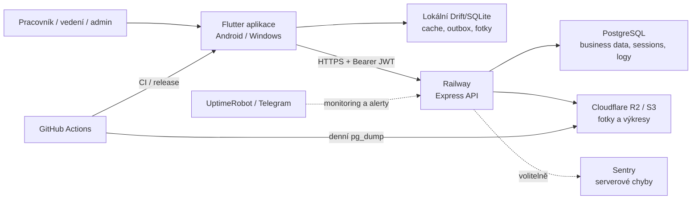

# Master mapa aplikace UNIFAST Ucpávky

**Stav mapování:** 2026-06-27  
**Mapovaná verze klienta:** `1.0.8+9`  
**Účel:** centrální katalog funkcí, obrazovek, rolí, oprávnění, dat, bezpečnosti, provozu, infrastruktury, limitů, licencí, certifikátů, norem, ověřených oprav a otevřených rizik.

> Tento dokument rozlišuje implementaci, test, produkční ověření a formální shodu. Přítomnost bezpečnostní funkce neznamená certifikaci ani automatickou shodu s právním předpisem.

## 1. Legenda a pravidla důkazů

| Značka | Význam |
|---|---|
| ✅ | Doloženo v aktuálním kódu a/nebo automatickým testem |
| 🟢 | Ověřeno také proti živému produkčnímu prostředí |
| 🟡 | Částečné, backend-only, vyžaduje ruční postup nebo chybí část životního cyklu |
| ⚪ | Existuje tvrzení nebo konfigurace, ale nebylo v tomto mapování prakticky ověřeno |
| ❌ | Nenalezeno nebo prokazatelně chybí |
| 📜 | Právní, smluvní nebo normativní požadavek; vyžaduje samostatné posouzení |

Pořadí zdrojů pravdy:

1. databázové migrace a aktuální schéma,
2. backendová autorizace a business logika,
3. automatické testy,
4. frontendové routy a viditelnost,
5. provozní konfigurace a živé endpointy,
6. dokumentace.

Dokumentace je pomocný zdroj, nikoli definitivní důkaz. Backendové schéma a testy jsou autorita; aktuální aplikační role jsou `worker`, `vedeni`, `admin`.

## 2. Manažerské shrnutí

| Oblast | Aktuální stav | Poznámka |
|---|---|---|
| Účel | ✅ Interní evidence požárních ucpávek | Terénní práce, kontrola, soupisy, export a audit |
| Klienti | ✅ Android, Windows; zdrojově také další Flutter platformy | Produkční distribuce je připravená hlavně pro Android a Windows |
| Backend | 🟢 Node.js/Express/Prisma na Railway | `/ready` dne 2026-06-27: DB `ok`, storage `s3`, public uploads `false` |
| Databáze | 🟢 PostgreSQL | Migrace a integrita ověřeny backend testy |
| Soubory | 🟢 S3-kompatibilní Cloudflare R2 | Fotky a výkresy se stahují přes autorizované API |
| Offline | ✅ Drift/SQLite + outbox + push/pull sync | Background sync na Androidu není garantovaný v Doze |
| Role | ✅ `worker`, `vedeni`, `admin` | Backend je zdroj pravdy |
| Testy backendu | ✅ 49 sad / 322 testů | Vše prošlo 2026-06-27 |
| Testy frontendu | ✅ 176 offline/widget testů | Vše prošlo 2026-06-27 |
| Runtime frontend testy | 🟡 Vyžadují samostatně běžící backend | Samotné `flutter test` je spouští bez backendu a proto není správný příkaz pro celý projekt |
| Statická kontrola | 🟡 0 errors, 0 warnings, 18 info | Hlavně deprecated API a stylistické nálezy |
| Známé zranitelnosti Node produkce | ✅ 0 dle `npm audit --omit=dev` | Momentka k 2026-06-27, nikoli trvalá záruka |
| Formální certifikace aplikace | ❌ Nedoložena | Žádný ISO certifikát, auditní atest ani prohlášení o shodě |
| GDPR dokumentace | 🟡 Technické prvky existují, governance chybí | Chybí úplný registr zpracování, informační text, právní tituly a smlouvy se zpracovateli |
| Kapacita | ⚪ Určeno pro interní desítky uživatelů | Bez load testu nelze slíbit konkrétní počet souběžných uživatelů nebo SLA |

## 3. Architektura a hranice důvěry

Hranice důvěry a odpovědnosti:

- Zařízení uživatele může být ztraceno, odemčeno třetí osobou nebo offline.
- Mobilní/desktop klient není bezpečnostní autorita; veškerá práva musí vynutit backend.
- Internet a TLS terminace jsou mimo aplikaci, spravované hostingem.
- Railway, PostgreSQL, R2, GitHub a případně Sentry jsou externí dodavatelé.
- Lokální SQLite a uložené fotografie obsahují firemní data; nejsou v aplikaci šifrovány vlastním klíčem.
- Záloha je samostatná kopie osobních i business dat a musí být zahrnuta do retenčních a výmazových procesů.

## 4. Aktéři, role a postavení

### 4.1 Aktéři

| Aktér | Postavení | Typické cíle |
|---|---|---|
| Pracovník (`worker`) | Terénní uživatel | Připojit se ke stavbě, evidovat ucpávky, fotit, umisťovat na plán, synchronizovat, odevzdat svůj soupis |
| Vedení (`vedeni`) | Provozní správce a kontrolor | Správa staveb, pater, lidí, kontrola ucpávek, ceník, soupisy, fakturační workflow, reporty a logy |
| Super Admin (`admin`) | Nouzový nejvyšší účet | Vše z vedení, obnova koše, zálohy, anonymizace uživatelů a administrativní zásahy |
| Zákazník | Není přihlášenou rolí | Dostává zákaznický soupis/export bez cen; samostatný zákaznický portál neexistuje |
| Vývojář/DevOps | Mimo aplikační RBAC | GitHub, Railway, R2, DB, secrets, release a incident response |
| Správce osobních údajů | Organizační role mimo aplikaci | Určuje účely, právní tituly, retenci a vyřizuje práva subjektů údajů |
| Zpracovatelé | Externí dodavatelé | Railway, Cloudflare, GitHub a případně Sentry podle smluvního nastavení |

### 4.2 Hierarchie

- `worker` není podmnožinou všech práv vedení; objektové scopy a workflow se vynucují nad rámec role.
- `vedeni` nesmí vytvářet, upravovat ani zobrazovat admin účty.
- `admin` je v UI označen jako nouzový účet; běžnou správu má dělat vedení.
- Worker je navíc omezen účastí na konkrétní stavbě.
- Worker může upravovat ucpávky jiného workera na stejné přidělené stavbě; autorství původního záznamu zůstává zachováno.

## 5. Obrazovky, viditelnost a navigace

| Obrazovka / cesta | Worker | Vedení | Admin | Hlavní účel |
|---|:---:|:---:|:---:|---|
| `/login` | ✓ | ✓ | ✓ | Přihlášení |
| `/change-pin` | ✓ | ✓ | ✓ | Povinná nebo dobrovolná změna PIN |
| `/` | ✓ | ✓ | ✓ | Hlavní menu a akční přehled |
| `/profile` | ✓ | ✓ | ✓ | Profil, změna PIN, vlastní aktivita a soupisy |
| `/jobs` | ✓ | ✓ | ✓ | Zakázky dostupné dané roli |
| `/floors/:jobId` | omezeno účastí | ✓ | ✓ | Patra stavby |
| `/floor-plan/:floorId` | omezeno účastí | ✓ | ✓ | Výkres, markery a filtry |
| `/seals/:floorId` | omezeno účastí | ✓ | ✓ | Seznam ucpávek |
| `/seal/new` | omezeno účastí a stavem jobu | ✓ | ✓ | Nová ucpávka |
| `/seal/:id` | omezeno účastí | ✓ | ✓ | Detail ucpávky |
| `/seal/:id/edit` | dle stavu ucpávky | ✓ | ✓ | Editace ucpávky |
| `/sync` | ✓ | ✓ | ✓ | Fronta, konflikty a ruční synchronizace |
| `/messages` | ✓ | ✓ | ✓ | Soukromé zprávy |
| `/notifications` | ✓ | ✓ | ✓ | Systémové notifikace |
| `/search` | ✓, výsledky omezené | ✓ | ✓ | Globální hledání |
| `/soupisy` | vlastní | všechny | všechny | Hlavní centrum soupisů a reportů |
| `/saved-worksheets` | vlastní | všechny | všechny | Uložené soupisy |
| `/worksheets/:id` | vlastní/účast | všechny | všechny | Detail a workflow soupisu |
| `/stats` | vlastní data | celkový dashboard | celkový dashboard | KPI a přehledy |
| `/price-list` | čtení | čtení a správa | čtení a správa | Ceník |
| `/jobs-admin` | — | ✓ | ✓ | Správa staveb, pater a účastníků |
| `/users-admin` | — | ✓ bez admin účtů | ✓ | Správa uživatelů |
| `/logs` | — | ✓ s anonymizací admina | ✓ | Provozní a auditní logy |
| `/trash` | — | — | ✓ | Smazané ucpávky a obnova |
| Opravy ucpávek | ❌ | ❌ | ❌ | Backend existuje, frontendová obrazovka a route chybí |
| Zálohy/storage verify | ❌ | ❌ | ❌ | Admin vidí stav DB/object/restore záloh v log sekci Zálohy; storage verify zůstává admin API |

Další pravidla:

- Nepřihlášený uživatel je přesměrován na login.
- Uživatel s `mustChangePin=true` je přesměrován na změnu PIN.
- Frontendové skrytí položky je pouze UX; backend provádí vlastní autorizaci.
- `reports` a starší `worksheets` cesta jsou přesměrovány do sjednoceného centra `/soupisy`.
- Starší `/job-number` a `/my-jobs` cesty přesměrovávají na `/jobs`.

## 6. Katalog funkcí

### 6.1 Autentizace a účet

- ✅ Přihlášení uživatelským jménem a PIN 6–8 znaků.
- ✅ PIN je uložen jako bcrypt hash.
- ✅ JWT obsahuje identitu session; v DB je uložen pouze hash tokenu.
- ✅ Serverová session má platnost 7 dní a je revokovatelná.
- ✅ Logout maže aktuální session.
- ✅ Změna PIN zneplatní ostatní session.
- ✅ Deaktivovaný účet nemůže login ani pokračovat s existující session.
- ✅ `mustChangePin` vynutí změnu po prvním přihlášení.
- ✅ Per-IP login limit 30 pokusů / 15 minut.
- ✅ Per-account lockout po 10 neúspěšných pokusech / 15 minut.
- ✅ Admin/vedení může resetovat PIN podřízeného účtu.
- ✅ Admin MFA: TOTP, recovery kódy, step-up pro citlivé operace a startup gate při `ADMIN_MFA_REQUIRED=true`.
- ❌ Biometrie, SSO, OIDC a passkeys.
- ❌ Uživatel nemá seznam svých aktivních session ani tlačítko „odhlásit všechna zařízení“.

### 6.2 Stavby a patra

- ✅ Vytvoření, úprava a soft delete stavby.
- ✅ Jedinečné osmimístné číslo projektu.
- ✅ Stavy `active`, `completed`, `archived`.
- ✅ Worker vidí pouze aktivní přidělené stavby.
- ✅ Worker se může připojit zadáním čísla stavby; endpoint je rate-limitovaný.
- ✅ Správa účastníků stavby.
- ✅ Vytvoření, přejmenování, řazení a mazání patra.
- ✅ Zákaz mazání stavby s aktivními ucpávkami.
- ✅ Export celé stavby CSV/PDF.
- ✅ Aktivita konkrétní stavby.

### 6.3 Ucpávky

- ✅ Vytvoření, detail, editace, seznam a filtrování.
- ✅ Číslo ucpávky je jedinečné v rámci aktivních záznamů patra.
- ✅ Automatický návrh nejnižšího volného čísla.
- ✅ Řemeslo: elektrikáři, vzduchaři, vodaři, topenáři, plynaři, ostatní, neurčeno.
- ✅ Systém, konstrukce, umístění, požární odolnost, veřejná a interní poznámka.
- ✅ Více prostupů/položek v jedné ucpávce.
- ✅ Typ, rozměr, množství, izolace, materiály a podmíněná pole.
- ✅ Výpočty plochy, obvodu/mb, odečtu a čisté plochy.
- ✅ Cenotvorba z aktivního ceníku.
- ✅ Statusy `draft`, `checked`, `invoiced`.
- ✅ Kontrola povinných polí a fotografie před schválením.
- ✅ Review stav a komentář.
- ✅ Hromadná změna statusu, přesun a CSV export.
- ✅ Soft delete, admin koš a obnova.
- ✅ Historie a field-level change log.
- ✅ Worker editací kontrolované ucpávky vrátí záznam do draftu.
- ✅ Fakturovaná ucpávka je pro workera zamčená.
- ✅ `photo.delete` je soft-delete pro vedení/admin, vyžaduje důvod a zachovává auditní stopu.

### 6.4 Fotky

- ✅ Fotoaparát a galerie/soubor.
- ✅ Lokální perzistentní uložení před uploadem.
- ✅ Offline fronta a opakování uploadu.
- ✅ Povolené obrázkové formáty, kontrola MIME/přípony a obrazového obsahu.
- ✅ Maximálně 15 MB na vstupní fotografii.
- ✅ Server obrázek re-enkóduje do WebP.
- ✅ Autorizované stažení; produkce nemá veřejný uploads adresář.
- ✅ Metadata velikosti, MIME, autora a času.
- ❌ Mazání fotografie.
- ❌ Antivirový skener; riziko je sníženo dekódováním a re-enkódováním.
- ❌ Automatická redakce obličejů, SPZ nebo jiných osobních údajů na fotografii.

### 6.5 Plány pater a markery

- ✅ Upload PNG/JPG/PDF dle implementace služby a klienta.
- ✅ Limit výkresu 25 MB.
- ✅ Rozlišení, rozměry a metadata výkresu.
- ✅ Lokální stažení/prefetch výkresu.
- ✅ Markery s normalizovanými souřadnicemi 0–1.
- ✅ Umístění, přesun a odstranění markeru.
- ✅ Stav „čeká na umístění“.
- ✅ Výměna výkresu odstraní staré markery a označí ucpávky k novému umístění.
- ✅ Filtry markerů, zaměření a export plánu do PDF.
- ✅ Varování u nízkého rozlišení rastrového plánu.

### 6.6 Offline a synchronizace

- ✅ Lokální SQLite/Drift cache staveb, pater, ucpávek, markerů a fotek.
- ✅ Outbox změn.
- ✅ Push po dávkách a pull s kurzorem.
- ✅ Idempotence přes jedinečné `mutationId`.
- ✅ Optimistic concurrency přes `version` / `baseVersion`.
- ✅ Konflikty jsou uloženy a zobrazeny uživateli.
- ✅ Retry plán 30 s, 2 min, 5 min.
- ✅ Oddělení fronty podle přihlášeného uživatele.
- ✅ Tombstones pro smazané záznamy.
- ✅ Remap lokálního ID na serverové ID včetně návazných fotografií.
- ✅ Ruční synchronizace.
- 🟡 Časovač po návratu do popředí funguje, ale Android Doze negarantuje background běh.
- ❌ WorkManager/background service pro garantovanější doručení.
- ❌ E2E šifrování lokální business databáze vlastním aplikačním klíčem.

### 6.7 Soupisy, reporty a fakturační workflow

- ✅ Reporty podle stavby, patra, workera, statusu, systému, typu a data.
- ✅ CSV a PDF s českou diakritikou.
- ✅ Worker exportuje jen vlastní/dostupná data.
- ✅ Pracovní soupis `worker` s cenami.
- ✅ Zákaznický soupis `customer` bez cen.
- ✅ Workflow `draft → submitted → reviewed → ready_for_invoice → invoiced → archived`.
- ✅ Vrácení do draftu s povinným komentářem.
- ✅ Zamčení ucpávkových položek po odevzdání soupisu.
- ✅ Admin override zámku.
- ✅ Cenový snapshot chrání historickou cenu před pozdější změnou ceníku.
- ✅ Jedna pracovní položka může být jen v jednom fakturovatelném worker soupisu.
- ✅ Zákaznické soupisy mohou stejný prostup sdílet.
- ✅ Mazání pouze draft soupisu.
- ✅ Hromadné změny statusu.
- ✅ Součty po patrech a celkem bez DPH.
- 🟡 Aplikace připravuje podklady k fakturaci; není účetním systémem ani daňovým dokladem.
- ❌ Elektronický podpis, kvalifikované časové razítko a neměnný WORM archiv.

### 6.8 Ceník

- ✅ Čtení aktivního ceníku všemi rolemi.
- ✅ Verze, platnost a historie.
- ✅ Pouze jedna aktivní verze v DB.
- ✅ Cena s materiálem / bez materiálu podle nastavení uživatele.
- ✅ Publikace nové verze vedením/adminem.
- ✅ Historické ceny v soupisech jsou snapshotované.
- 🟡 Chybí čtyřočkové schválení nové cenové verze.

### 6.9 Komunikace, notifikace, hledání a dashboard

- ✅ Soukromé zprávy mezi uživateli.
- ✅ Kontakty, nepřečtené počty a označení jako přečtené.
- ✅ Limit 60 odeslaných zpráv / 15 minut / uživatel.
- ✅ Systémové notifikace a read-all.
- ✅ Globální hledání ve stavbách, ucpávkách a pracovnících se scopingem.
- ✅ Dashboard managementu.
- ✅ Vlastní KPI workera.
- ✅ Rozpracované, vrácené, bez fotografie, dokončené/archivované a další akční počty.
- ❌ Push notifikace mimo aplikaci, e-mail a SMS.
- ❌ Přílohy, šifrovaný chat a administrátorská retenční politika zpráv.

### 6.10 Opravy ucpávek

- ✅ Backend vytváří samostatný záznam opravy bez přepsání originálu.
- ✅ Uchovává snapshot originálu, nová data, změněná pole, poznámku a autora.
- ✅ Worker vidí pouze opravy dostupných staveb.
- ✅ Vedení/admin může exportovat opravy.
- ✅ Osobní identita admina je pro nižší roli anonymizována.
- 🟡 Modul nemá frontendovou obrazovku ani navigaci.
- 🟡 Smazání původní ucpávky kaskádově smaže opravu; je nutné potvrdit požadovanou retenční politiku.

### 6.11 Logy, chyby a audit

- ✅ Login log, activity log, change log, error log, sync a photo log pohledy.
- ✅ Vlastní aktivita dostupná každému přihlášenému.
- ✅ Systémové logy pouze admin.
- ✅ Vedení/admin vidí auditní logy podle oprávnění.
- ✅ Admin je pro vedení anonymizován.
- ✅ Klient nabídne přihlášenému uživateli odeslání zachycené chyby.
- ✅ Klientský report obsahuje zprávu, stack, route, verzi a platformu.
- ✅ Server nevrací klientovi stack u 500.
- ✅ Retence technických logů je v produkci standardně 90 dní.
- 🟡 Klientský stack/route mohou obsahovat citlivé údaje; není implementována automatická redakce.
- 🟡 Sentry je volitelný a jeho reálná produkční konfigurace nebyla tímto mapováním potvrzena.

### 6.12 Aktualizace aplikace

- ✅ Veřejný read-only endpoint s informací o vydání pro Android/Windows.
- ✅ Volitelná a vynucená aktualizace podle `minBuild`.
- ✅ Android APK release pipeline s podpisovým keystore.
- ✅ Windows installer přes Inno Setup.
- ✅ GitHub Release pro tag `v*`.
- ✅ Release klient se bez produkčního `API_BASE_URL` nespustí.
- 🟡 Windows instalátor není kódově podepsaný a může vyvolat SmartScreen.
- ❌ Automaticky publikovaný SHA-256 součet, SBOM, provenance/attestation a podepsané release notes.

## 7. Matice backendových oprávnění

Backendová matice obsahuje 31 pojmenovaných oprávnění:

| Oprávnění | Worker | Vedení | Admin | Další omezení |
|---|:---:|:---:|:---:|---|
| `seal.create` | ✓ | ✓ | ✓ | Worker jen zapisovatelná přidělená stavba |
| `seal.edit` | ✓ | ✓ | ✓ | Stav ucpávky, jobu a worksheet lock |
| `seal.status` | — | ✓ | ✓ | Stavový automat |
| `seal.delete` | — | ✓ | ✓ | Soft delete |
| `seal.restore` | — | — | ✓ | Konflikt čísla může obnovu blokovat |
| `seal.history` | — | ✓ | ✓ | Auditní historie |
| `seal.override_locked` | — | ✓ | ✓ | Backend i frontend permission mirror |
| `photo.upload` | ✓ | ✓ | ✓ | Přístup k ucpávce |
| `photo.delete` | — | ✓ | ✓ | Soft-delete + povinný důvod |
| `job.manage` | — | ✓ | ✓ | Stavby a účastníci |
| `floor.manage` | — | ✓ | ✓ | Patra |
| `floor.drawing.manage` | — | ✓ | ✓ | Výkresy |
| `user.manage` | — | ✓ | ✓ | Vedení nesmí spravovat admina |
| `reports.view` | ✓ | ✓ | ✓ | Worker scope |
| `reports.export` | ✓ | ✓ | ✓ | Worker scope, rate limit |
| `priceList.view` | ✓ | ✓ | ✓ | — |
| `priceList.manage` | — | ✓ | ✓ | — |
| `logs.view` | — | ✓ | ✓ | Admin anonymizován pro vedení |
| `admin.trash` | — | — | ✓ | — |
| `admin.backup` | — | — | ✓ | Backend API, bez UI |
| `worksheet.create` | ✓ | ✓ | ✓ | Worker jen vlastní worker soupis |
| `worksheet.view` | ✓ | ✓ | ✓ | Worker jen vlastní/účast |
| `worksheet.delete` | ✓ | ✓ | ✓ | Pouze draft |
| `worksheet.submit` | ✓ | ✓ | ✓ | Worker scope řeší backend |
| `worksheet.review` | — | ✓ | ✓ | — |
| `worksheet.invoice` | — | ✓ | ✓ | — |
| `worksheet.archive` | — | ✓ | ✓ | Backend i frontend permission mirror |
| `stats.view` | ✓ | ✓ | ✓ | Worker jen vlastní data |
| `repair.create` | ✓ | ✓ | ✓ | Frontend chybí |
| `repair.view` | ✓ | ✓ | ✓ | Worker scope; frontend chybí |
| `repair.export` | — | ✓ | ✓ | Frontend chybí |

Neshody, které musí zůstat viditelné:

- Frontendová permission matice je synchronní s backendovým seznamem oprávnění.
- Backend je nadále autorita pro objektové scopy a workflow pravidla.
- `repair.*` a `admin.backup` jsou v permission mirroru, ale nemají plnohodnotné samostatné frontendové obrazovky.

## 8. Data, jejich citlivost a životní cyklus

| Kategorie | Příklady | Umístění | Citlivost | Retence / výmaz |
|---|---|---|---|---|
| Identita uživatele | username, jméno, role, režim materiálu | PostgreSQL | osobní údaje | Bez časového limitu; admin anonymizace |
| Autentizace | bcrypt PIN hash, session hash, expirace | PostgreSQL; token v secure storage | vysoce citlivé | Session 7 dní nebo revokace |
| Login metadata | IP, user-agent, úspěch/neúspěch | PostgreSQL | osobní/bezpečnostní | Standardně 90 dní |
| Stavby | číslo, název, adresa, poznámka | PostgreSQL + lokální cache | firemní, může obsahovat osobní údaje | Bez definované retenční doby |
| Ucpávky | technická data, lokace, poznámky, ceny | PostgreSQL + lokální cache | firemní, bezpečnostní dokumentace | Soft delete; bez definované konečné retence |
| Fotky | obraz stavby, případné osoby/SPZ | R2 + lokální zařízení | potenciálně osobní a důvěrné | Nemazatelné přes API; politika chybí |
| Výkresy | plány pater | R2 + lokální zařízení | důvěrné stavební informace | Výměna/mazání managementem |
| Markery | poloha ucpávky na plánu | PostgreSQL + lokální cache | technická data | Podle výkresu/ucpávky |
| Ceny a soupisy | jednotkové ceny, pracovní výkon, fakturační stav | PostgreSQL | obchodní a personální | Bez definované retenční doby |
| Soukromé zprávy | obsah, odesílatel, příjemce | PostgreSQL | osobní/komunikační | Výmaz při anonymizaci účtu; jinak bez TTL |
| Notifikace | obsah a vazba na uživatele | PostgreSQL | interní | Výmaz při anonymizaci; jinak bez TTL |
| Audit | aktivity, změny stará/nová hodnota | PostgreSQL | osobní a bezpečnostní | Technický scheduler 90 dní dle implementovaných tabulek; ověřit přesný rozsah |
| Chyby | message, stack, cesta, user ID, metadata | PostgreSQL/Sentry | může obsahovat osobní data/secrets | 90 dní lokálně; Sentry retence není doložena |
| Sync | device ID, payload, výsledek | PostgreSQL + zařízení | může duplikovat business/osobní data | Standardně 90 dní na serveru; lokální cleanup dle klienta |
| Zálohy | kopie celé DB | R2 | všechny DB kategorie | 30 dní dle workflow |

### 8.1 Implementovaný GDPR výmaz

- ✅ Pouze admin může anonymizovat účet.
- ✅ Nelze anonymizovat vlastní admin účet.
- ✅ Účet se deaktivuje a dostane nereprodukovatelný hash přihlášení.
- ✅ Jméno a username se nahradí anonymními hodnotami.
- ✅ Smažou se session, login logy, soukromé zprávy a notifikace.
- ✅ Business záznamy a auditní vazby zůstanou pod anonymním uživatelem.
- 🟡 Starší zálohy mohou původní údaje obsahovat až do konce 30denní retence.
- 🟡 Chybí dokumentovaný postup, který při obnově staré zálohy znovu aplikuje požadavky na výmaz.
- 🟡 Chybí samoobslužný export osobních údajů, evidence žádostí a lhůt.

### 8.2 Otevřené privacy úkoly

- ❌ Určit správce, účely a právní titul každé kategorie.
- ❌ Vytvořit záznamy o činnostech zpracování.
- ❌ Informační text pro zaměstnance/uživatele.
- ❌ DPA/smlouvy a seznam subzpracovatelů: Railway, Cloudflare, GitHub, Sentry.
- ❌ Posoudit mezinárodní předávání a regiony uložení.
- ❌ Stanovit retenci business evidence, fotek, výkresů, soupisů a zpráv.
- ❌ Proces incidentu s osobními údaji včetně rozhodnutí o hlášení.
- ❌ Redakce citlivých hodnot v klientských/serverových chybách.
- ❌ DPIA screening; plné DPIA jen pokud vyjde vysoké riziko.
- ❌ Pravidla focení osob, SPZ, dokumentů a jiných vedlejších osobních údajů.

## 9. Bezpečnostní mapa

### 9.1 Implementované kontroly

- ✅ HTTPS produkční endpoint.
- ✅ Helmet security headers.
- ✅ Konkrétní CORS nebo explicitní fail-fast při wildcardu v produkci.
- ✅ `trust proxy = 1` pro Railway.
- ✅ Produkční fail-fast pro slabý JWT secret, veřejné uploady a chybějící S3.
- ✅ Autentizace každého chráněného API requestu.
- ✅ Serverové RBAC a object-level authorization.
- ✅ Worker scoping podle účasti na stavbě.
- ✅ Statusové a workflow zámky.
- ✅ Zod validace vstupů.
- ✅ Limity JSON a uploadů.
- ✅ Ochrana proti path traversal u object keys.
- ✅ Obrázky se dekódují a znovu zakódují.
- ✅ Rate limiting loginu, joinu stavby, zpráv, sync push a exportů.
- ✅ Audit důležitých operací a změn.
- ✅ Bez stack trace v odpovědi 500.
- ✅ Token v `flutter_secure_storage`.
- ✅ Produkční Android release nemá cleartext výjimky; lokální HTTP je povolené jen v debug/profile manifestech.
- ✅ Podepsaný Android release.
- ✅ GitHub secrets pro podpis a infrastrukturu.
- ✅ S3 storage je ověřitelný write/read probe.

### 9.2 Chybějící nebo neověřené vrstvy

- ✅ Admin MFA/TOTP a silnější admin heslo; ❌ SSO/passkeys.
- ❌ Šifrování lokální SQLite a lokálních fotografií aplikačním klíčem.
- ❌ Remote wipe, device binding, MDM enforcement a detekce root/jailbreak.
- ❌ Certificate pinning; není povinné, ale je to možná další vrstva pro řízená zařízení.
- ❌ Globální API rate limit.
- 🟡 Rate limit používá výchozí paměťový store; při horizontálním škálování nebude sdílený.
- ❌ WAF/DDoS politika doložená pro konkrétní službu.
- ❌ Pravidelný penetrační test a mobilní security test.
- ❌ SAST, DAST, secret scanning a dependency audit jako povinné CI gates.
- ❌ SBOM a řízení zranitelností s definovanými SLA.
- ❌ Threat model a abuse-case katalog.
- ❌ Security incident response runbook s kontakty a rozhodovacími lhůtami.
- ❌ Doložená rotace JWT, DB, R2, Telegram, Sentry a signing secrets.
- ❌ Oddělený staging.
- ❌ Doložené šifrování DB/R2 at rest a správa klíčů ze strany providerů.
- ❌ Databázové RLS; ochrana je v aplikační vrstvě.
- ❌ Immutabilní audit/WORM; admin infrastruktury může DB změnit.
- ❌ Ochrana release artefaktů pomocí checksumů, provenance a Windows code signing.

## 10. Infrastruktura, provoz a kontinuita

| Komponenta | Technologie / poskytovatel | Stav |
|---|---|---|
| Klient | Flutter 3.44+, Riverpod, go_router, Dio | ✅ |
| Lokální DB | Drift/SQLite | ✅ |
| Backend | Node.js 20+, Express 4, TypeScript | 🟢 |
| ORM | Prisma 6 | ✅; upozornění na budoucí přesun configu pro Prisma 7 |
| Primární DB | PostgreSQL na Railway | 🟢 |
| Object storage | Cloudflare R2 přes S3 API | 🟢 |
| CI | GitHub Actions + PostgreSQL service | ✅ |
| Release | GitHub Actions, GitHub Releases | ✅ |
| DB backup | Denní `pg_dump` gzip do R2 | ⚪ Workflow existuje; aktuální úspěšnost běhů nebyla zde čtena |
| Backup retence | 30 dní | ✅ v workflow |
| In-process backup | Volitelný, ne DR | 🟡 |
| Monitoring chyb | Lokální ErrorLog + volitelný Sentry | 🟡 |
| Monitoring dostupnosti | Dokumentovaný UptimeRobot | ⚪ konfigurace nebyla ověřena |
| Alerting | Telegram při selhání backupu | ⚪ závisí na secrets |
| Health | `/health` bez DB kontroly | 🟢 |
| Readiness | `/ready` s DB a storage konfigurací | 🟢 |

### 10.1 Zálohy a disaster recovery

- ✅ Denní workflow ve 02:00 UTC.
- ✅ `pg_dump` klient odpovídající PostgreSQL 18 produkci.
- ✅ Gzip integrity test.
- ✅ Off-site upload do R2.
- ✅ Mazání záloh starších 30 dní.
- ✅ Telegram alert při neúspěchu, pokud jsou secrets.
- ✅ Dokumentovaný restore postup.
- ✅ Prakticky doložený restore test s datem, dobou a výsledkem (2026-06-28; průběžně `dr-restore-test.yml`).
- ❌ Definovaný a schválený RPO/RTO.
- ⚪ Návrhové RPO je maximálně přibližně 24 hodin jen tehdy, pokud denní backup skutečně pravidelně prochází.
- ✅ RTO ověřeno restore testem; cíl zůstává nejvýše 4 h.
- ❌ Point-in-time recovery není doloženo.
- ❌ Nezávislá druhá storage/region kopie není doložena.

### 10.2 Škálování

- Backend je převážně stateless; session jsou v DB a soubory v R2.
- Horizontální škálování blokují nebo komplikují:
  - in-memory rate limiter,
  - možné vícenásobné spuštění schedulerů,
  - neověřený DB connection pool,
  - CPU/RAM náročné PDF a image operace,
  - chybějící fronta pro dlouhé úlohy.
- Pro vyšší provoz přidat Redis/shared limiter, job queue, oddělené workers, měření DB poolu a autoscaling test.

## 11. Kapacity a technické limity

| Limit | Hodnota |
|---|---:|
| Session | 7 dní |
| Login per IP | 30 / 15 min |
| Lockout účtu | 10 neúspěchů / 15 min |
| Join stavby workerem | 60 / 15 min / uživatel |
| Zprávy | 60 / 15 min / uživatel |
| Sync push requesty | 300 / 15 min / uživatel |
| Exporty | 40 / 15 min / uživatel |
| JSON body | 2 MB |
| Fotografie | 15 MB |
| Výkres | 25 MB |
| Sync push batch | 50 mutací |
| Sync pull batch | 500 položek |
| Report query seal batch | 2 000 |
| Report řádků | 10 000 |
| Export stavby | 2 000 ucpávek |
| Historie v exportu stavby | 80 záznamů |
| Foto náhledy v exportu | 60 |
| Fotografie na jednu ucpávku v exportu | 2 |
| Technické logy | standardně 90 dní |
| Off-site DB backup | denně, retence 30 dní |

### 11.1 Pro kolik lidí je aplikace

Aktuální důkaz podporuje formulaci:

> Aplikace je navržena pro interní provoz firmy v řádu desítek uživatelů, ale konkrétní počet současně aktivních uživatelů nebyl load testem ověřen.

Nelze zatím garantovat:

- počet souběžných přihlášení,
- počet syncujících zařízení ve stejné sekundě,
- počet paralelních PDF exportů,
- maximální počet ucpávek/fotek na jednu stavbu bez degradace,
- dostupnost v procentech,
- odezvu P95/P99,
- RPO/RTO.

Minimální kapacitní test:

1. 10, 25, 50 a 100 virtuálních uživatelů.
2. Mix login, seznam staveb, detail ucpávky, sync push/pull, upload 5MB fotky a export.
3. Samostatný spike test exportů a uploadů.
4. Dataset alespoň 100 staveb, 100 000 ucpávek a reprezentativní počet fotografií.
5. Měřit P50/P95/P99, error rate, CPU, RAM, DB connections, query time a R2 latenci.
6. Stanovit přijatelné SLO a teprve potom deklarovat kapacitu.

## 12. Napojení a externí služby

| Napojení | Směr | Data | Autentizace | Riziko / úkol |
|---|---|---|---|---|
| Railway | hosting | veškerý API provoz a DB | platform secrets | DPA, region, SLA, access review |
| PostgreSQL | backend ↔ DB | všechna strukturovaná data | connection URI | least privilege, TLS a PITR ověřit |
| Cloudflare R2 | backend ↔ storage | fotky, výkresy, backupy | S3 keys | oddělit aplikační a backup credentials |
| GitHub | CI/release/backup | source, artefakty, DB dump transit | Actions secrets | branch protection, 2FA a audit přístupů |
| Sentry | backend → monitoring | chyby a možná metadata | DSN | privacy, redakce, region, retence |
| UptimeRobot | monitor → `/ready` | dostupnost a základní stav | veřejný endpoint | neobsahovat citlivé údaje |
| Telegram | workflow → alert | název projektu/run URL | bot token | omezení obsahu alertu |
| Android OS | klient | kamera, fotky, síť, storage | runtime permissions | minimalizace oprávnění |
| GitHub Releases | klient → download | instalační balíky | veřejná HTTPS URL | checksum/provenance |

Nenalezená napojení:

- účetní/ERP systém,
- firemní adresář/SSO,
- e-mail/SMS/push provider,
- BIM/CDE systém,
- zákaznický portál,
- systém kvality/certifikátů,
- antivirus/DLP/SIEM,
- externí API výrobců požárních systémů.

## 13. Android oprávnění a platformní zabezpečení

| Oprávnění | Důvod | Stav |
|---|---|---|
| `INTERNET` | API, soubory, aktualizace | ✅ |
| `ACCESS_NETWORK_STATE` | detekce konektivity a sync | ✅ |
| `CAMERA` | fotografie ucpávky | ✅ |
| `READ_MEDIA_IMAGES` | výběr obrázku na Android 13+ | ✅ |
| `READ_EXTERNAL_STORAGE` do API 32 | starší Android galerie | ✅ |

Další platformní body:

- Produkční release manifest nastavuje `android:usesCleartextTraffic="false"` a neodkazuje na debug network config.
- Main network config neobsahuje žádné `cleartextTrafficPermitted="true"` výjimky.
- Debug/profile build dovoluje cleartext přes vlastní manifest a network config; nesmí být distribuován jako produkce.
- Android release je podepsán vlastním keystore.
- Windows aplikace/installer nemá doložený code-signing certifikát.
- Aplikace nemá MDM policy, remote wipe ani vynucený screen lock.

## 14. Licence, certifikáty a povolení

### 14.1 Software licence

- Projekt je označen jako `private` / `publish_to: none`.
- ❌ V kořeni repozitáře není vlastní `LICENSE`, `NOTICE` ani licenční politika.
- Přímé backend závislosti mají převážně MIT nebo Apache-2.0 licence.
- Lokální `npm query` našel v transitive stromu hlavně MIT, Apache-2.0, ISC a BSD licence; několik balíčků nemělo vyplněné licenční pole.
- `pubspec.lock` uzamyká Flutter balíčky, ale v repozitáři není vygenerovaný Flutter license report.
- ❌ Není commitnutý SBOM (CycloneDX/SPDX).
- ❌ Není seznam third-party notices distribuovaný s aplikací.
- ❌ Není automatický CI gate na zakázané/copyleft/neznámé licence.

Před externí distribucí:

1. Určit vlastníka a licenci proprietárního kódu.
2. Vygenerovat Node i Dart/Flutter SBOM.
3. Vygenerovat `THIRD_PARTY_NOTICES`.
4. Právně zkontrolovat fonty, ikony, obrázky, PDF knihovny a nativní binárky.
5. Přidat proces kontroly při každém releasu.

### 14.2 Technické certifikáty a podpisy

| Položka | Stav |
|---|---|
| TLS certifikát produkčního API | 🟢 HTTPS funguje; správu provádí hosting |
| Android signing certificate | ✅ CI vyžaduje release keystore |
| Windows code-signing certificate | ❌ |
| Podepsané checksumy release | ❌ |
| ISO/IEC 27001 certifikát organizace/aplikace | ❌ nedoložen |
| Penetrační test / bezpečnostní atest | ❌ nedoložen |
| Audit GDPR / DPIA | ❌ nedoložen |
| CRA posouzení shody / CE pro software | ❌ nedoloženo; nejprve určit působnost |

### 14.3 Oborové certifikáty požárních ucpávek

Aplikace aktuálně eviduje požární odolnost, systém, konstrukci, materiály a fotografie, ale nenalezena byla plná evidence:

- ❌ výrobce a přesné označení výrobku/systému,
- ❌ ETA/EAD nebo jiné technické posouzení,
- ❌ DoP/DoPC a verze dokumentu,
- ❌ CE označení a identifikátor,
- ❌ klasifikační protokol a zkušební protokol,
- ❌ norma/metoda klasifikace,
- ❌ rozsah použití, omezení podkladu, tloušťky a prostupu,
- ❌ číslo šarže a expirace materiálu,
- ❌ certifikace/školení montážníka a její platnost,
- ❌ kontrolor, datum kontroly a elektronické schválení,
- ❌ příloha PDF certifikátu,
- ❌ vazba konkrétní ucpávky na konkrétní verzi certifikátu,
- ❌ neměnný snapshot certifikačních údajů při schválení/fakturaci,
- ❌ upozornění na expiraci nebo odebrání certifikátu.

Doporučené nové entity:

- `ProductSystem`,
- `CertificateDocument`,
- `ProductBatch`,
- `InstallerQualification`,
- `SealComplianceSnapshot`,
- `Inspection`,
- `NonConformity`,
- `CorrectiveAction`.

Bez této vrstvy je aplikace silná evidence práce, ale není úplným systémem prokazování shody požární ucpávky.

## 15. Právní a normativní mapa

Následující položky jsou kandidáti k posouzení, nikoli tvrzení, že všechny na aplikaci dopadají.

| Předpis / norma | Proč je relevantní | Aktuální stav aplikace |
|---|---|---|
| [GDPR – nařízení (EU) 2016/679](https://eur-lex.europa.eu/eli/reg/2016/679/oj) | Uživatelé, IP, zprávy, fotografie, aktivita | 🟡 technické prvky ano, governance neúplná |
| Zákon č. 110/2019 Sb. | České doplnění ochrany osobních údajů | 📜 právní kontrola chybí |
| [Zákon č. 264/2025 Sb. / nový zákon o kybernetické bezpečnosti](https://portal.nukib.gov.cz/pruvodce-novym-zakonem-o-kyberneticke-bezpecnosti) | Účinný od 1. 11. 2025; dopad podle regulované služby a organizace | ⚪ určit, zda je firma regulovaným subjektem/dodavatelem |
| [Cyber Resilience Act, EU 2024/2847](https://eur-lex.europa.eu/eli/reg/2024/2847/oj) | Požadavky na produkty s digitálními prvky uváděné na trh | ⚪ posoudit působnost interní/proprietární distribuce |
| [Construction Products Regulation, EU 2024/3110](https://eur-lex.europa.eu/eli/reg/2024/3110/oj) | Výrobky zabudované do stavby, deklarace výkonu a digitální produktová data | 🟡 aplikace eviduje práci, ne kompletní produktovou shodu |
| [EN 1366-3 a EN 13501-2 – klasifikace penetration seals](https://eur-lex.europa.eu/eli/dec/2000/367/2011-04-12/eng) | Zkoušení a klasifikace požární odolnosti prostupových ucpávek | 🟡 pole požární odolnosti existuje, důkazní dokumenty ne |
| [ISO/IEC 27001:2022](https://www.iso.org/standard/27001) | Systém řízení bezpečnosti informací | ❌ aplikace ani organizace nejsou doloženě certifikované |
| [ISO 22301:2019](https://www.iso.org/standard/75106.html) | Kontinuita provozu a obnova | 🟡 backup/runbook ano, RTO/RPO a cvičení ne |
| ISO 9001 | Kvalita, řízení neshod a nápravných opatření | 🟡 audit a opravy částečně, QMS workflow ne |
| ISO/IEC 25010 | Model kvality software | 🟡 funkčnost/testy silné, chybí formální metriky výkonu, použitelnosti a přenositelnosti |
| OWASP ASVS | Web/API aplikační bezpečnost | 🟡 řada kontrol existuje, formální verifikace ne |
| OWASP MASVS | Mobilní bezpečnost | 🟡 secure storage ano, lokální data a device controls ne |
| WCAG 2.2 / EN 301 549 | Přístupnost, zejména veřejné zakázky a širší použití | ❌ audit přístupnosti nenalezen |
| eIDAS | Jen pokud má schválení nahrazovat právně uznávaný elektronický podpis | ❌ současné statusy nejsou kvalifikovaný podpis |

Nutná rozhodnutí:

- Je aplikace čistě interní, dodávaná zákazníkům, nebo uváděná na trh?
- Je firma regulovaným subjektem podle zákona o kybernetické bezpečnosti?
- Jsou exporty pouze pracovní podklad, nebo oficiální předávací/protokolární dokument?
- Jak dlouho musí být požární, stavební, smluvní a účetní důkazy uchovány?
- Jaké produktové certifikáty a kvalifikace montážníků musí být povinně navázány?
- Kdo právně schvaluje záznam a jak se prokazuje jeho identita a čas?

## 16. API a integrační povrch

Aktuálně je definováno 106 route handlerů plus `/health` a `/ready`. Skupiny:

- Auth: login, logout, `me`, změna PIN.
- App release: metadata Android/Windows vydání.
- Jobs: moje stavby, join číslem, CRUD, statusy, účastníci, aktivita, export.
- Floors: CRUD, návrh čísla, placement stats, výkres, soubor, PDF, markery.
- Seals: seznam/detail/CRUD, status, review, historie, bulk operace, koš/restore.
- Photos: upload, autorizované stažení, záměrně zakázané mazání.
- Repairs: seznam, detail, vytvoření, CSV export.
- Sync: push a pull.
- Reports: filtry, summary, CSV, PDF.
- Logs: login, errors, activity, changes, sync, photos, admin, history, user/system/my activity.
- Users: seznam, vytvoření, změna, anonymizace.
- Messages: kontakty, zprávy, unread, odeslání, read.
- Notifications: seznam, unread, read-all, read.
- Price list: aktivní ceník, verze, publish, seed.
- Worksheets: seznam, create/generate, bulk status, detail, items/populate, delete, status, export.
- Stats: overview.
- Search: globální hledání.
- Admin: stav produkčních DB/object/restore záloh, legacy ad-hoc lokální backupy, storage verify.
- Client errors: odeslání chyby přihlášeným klientem.

API dokumentační mezery:

- ❌ OpenAPI/Swagger specifikace.
- ❌ Verzování API v URL nebo hlavičce.
- ❌ Publikovaný compatibility/deprecation policy.
- ❌ Strojově ověřovaný contract test klient–server.
- ❌ Idempotency keys mimo sync mutace.
- ❌ Standardizovaná pagination metadata napříč všemi seznamy.

## 17. Ověření kvality k 2026-06-27

### 17.1 Skutečně spuštěné kontroly

| Kontrola | Výsledek |
|---|---|
| Backend build + Jest | ✅ 49/49 sad, 322/322 testů |
| DB migrace test DB | ✅ 30 migrací, nic pending |
| Backend produkční dependencies audit | ✅ 0 známých vulnerabilities |
| Frontend offline/widget testy | ✅ 176/176 |
| Flutter analyze | 🟡 0 errors, 0 warnings, 18 info |
| Živý `/ready` | 🟢 DB ok, S3, public uploads false |
| Celé `flutter test` bez backendu | očekávaně selže runtime částí; není to validní E2E běh |

### 17.2 Pokryté rizikové scénáře

- ✅ Hash session tokenu a deaktivace uživatele.
- ✅ RBAC a zákaz přístupu k cizí stavbě.
- ✅ Worker scoping reportů/statistik.
- ✅ Duplicitní číslo ucpávky.
- ✅ Stavové přechody a zámky.
- ✅ Soft delete a restore.
- ✅ Validace typů prostupů a rozměrů.
- ✅ Ceny, decimal rounding a snapshot ceníku.
- ✅ Upload validního/nevalidního/velkého obrázku.
- ✅ Autorizace stahování fotografií.
- ✅ Floor drawing lifecycle a markery.
- ✅ Sync idempotence, konflikt, retry a tombstones.
- ✅ Worksheet ownership, workflow, lock, delete a export.
- ✅ Zákaznický vs pracovní soupis.
- ✅ Opravy a anonymizace admina.
- ✅ České CSV/PDF.
- ✅ Update checker a vynucení verze.
- ✅ Produkční config fail-fast.
- ✅ Storage path traversal a verify probe.

### 17.3 Testovací mezery

- ❌ Load/stress/soak test.
- ❌ Penetrační test a DAST.
- ❌ Test na fyzickém Androidu jako povinný release gate.
- ❌ Windows installer end-to-end install/upgrade/uninstall test.
- ✅ Obnova reálné produkční zálohy ověřena přes `dr-restore-test.yml`.
- ❌ Chaos test DB/R2/network outage.
- ❌ Accessibility test.
- ❌ Test lokalizace, velkého písma a screen readeru.
- ❌ Test obnovy po ztrátě/krádeži zařízení.
- ❌ Formální test kompatibility starého klienta s novým API.
- ❌ Produkční syntetická cesta login → sync → foto → export.

## 18. Ověřené opravy a ošetřené bugy

### 18.1 Bezpečnost a nasazení

- ✅ Multer 1.x nahrazen verzí 2.2.0.
- ✅ `trust proxy` pro Railway.
- ✅ PIN minimálně 6 znaků.
- ✅ Per-account lockout a `mustChangePin`.
- ✅ Produkční S3/R2 fail-fast.
- ✅ `PUBLIC_UPLOADS=false`.
- ✅ CORS produkční guard.
- ✅ JSON 404 odpověď.
- ✅ Node engine `>=20`.
- ✅ Rate limiting zpráv, sync a exportů.
- ✅ Android INTERNET permission v release manifestu.
- ✅ Release vyžaduje explicitní API URL.
- ✅ Android release signing pipeline.

### 18.2 Data a business pravidla

- ✅ Duplicita čísla ucpávky zachycena v DB i API.
- ✅ Floor musí patřit ke stavbě.
- ✅ Worker nemůže číst cizí stavbu přímým ID.
- ✅ Completed/archived job blokuje worker zápisy.
- ✅ Editace checked workerem vrací draft.
- ✅ Invoiced je pro workera zamčené.
- ✅ Prázdné entries nesmí vymazat všechny prostupy.
- ✅ Odečet nesmí překročit plochu otvoru.
- ✅ Ceník nemůže mít dvě aktivní verze.
- ✅ Cena soupisu se po změně ceníku nezmění.
- ✅ Worksheet položky respektují job a audience.
- ✅ Mazání soupisu jen v draftu.
- ✅ Změna výkresu vyčistí neplatné markery.
- ✅ Oprava nemění původní ucpávku.

### 18.3 Offline, soubory a export

- ✅ Sync mutation je idempotentní.
- ✅ Technická chyba se neoznačí jako úspěšně zpracovaná.
- ✅ Konflikt zůstane uložený.
- ✅ Lokální fotografie se ukládá mimo temporary directory.
- ✅ Chybějící lokální fotografie má srozumitelný failed stav.
- ✅ Remap lokálního seal ID přepojí fotografie.
- ✅ Upload kontroluje obsah a re-enkóduje.
- ✅ CSV má UTF-8 BOM a PDF český font.
- ✅ Android save dialog dostává bytes.
- ✅ PDF plán omezuje render size a stabilizuje zoom.

## 19. Aktivní známá omezení a rizika

### Priorita P0 – před tvrzením o plné shodě nebo vyšší kritičnosti

- ✅ Test obnovy zálohy běží týdně přes `dr-restore-test.yml`.
- 🟡 Admin MFA je implementované (TOTP + recovery + step-up); není phishing-resistant.
- ❌ Lokální SQLite a fotografie nejsou aplikačně šifrované.
- ❌ Chybí formální GDPR dokumentace a smluvní mapa zpracovatelů.
- ❌ Chybí model produktových certifikátů/ETA/DoP/CE a kvalifikací montážníků.
- ❌ Neexistuje penetrační ani load test.

### Priorita P1 – nejbližší stabilizace

- 🟡 Backend oprav nemá frontend.
- 🟡 Admin backup/storage API nemá frontend.
- ✅ Frontend a backend permission matice jsou synchronní.
- 🟡 Některé historické dokumenty a prezentace mohou stále obsahovat starší formulace; autoritou je tato master mapa a testy.
- 🟡 Android background sync není garantovaný.
- 🟡 Windows installer není podepsaný.
- 🟡 Chybí globální/shared rate limiter.
- 🟡 Chybí OpenAPI a verzování API.
- 🟡 Chybí automatická redakce chybových reportů.
- 🟡 18 Flutter analyzer info nálezů.
- 🟡 44 balíčků má novější verze mimo aktuální constraints; upgrade musí být řízený, ne automatický.
- 🟡 Prisma upozorňuje na odstranění `package.json#prisma` konfigurace v Prisma 7.

### Priorita P2 – rozvoj a governance

- ❌ SBOM a third-party notices.
- ❌ Accessibility audit.
- ❌ Push notifikace.
- ❌ SSO/MDM/device management.
- ❌ Staging a syntetický monitoring celé business cesty.
- ❌ SLO/SLA, kapacitní profil a error budget.
- ❌ Čtyřočkové schvalování ceníku a citlivých admin akcí.
- ❌ Auditní export s podpisem/časovým razítkem.

### Známá provozní omezení

- Staré fotografie z verzí před perzistentním lokálním uložením mohly být OS smazány z temp adresáře.
- `flutter test` bez spuštěného backendu zahrne runtime testy a očekávaně selže.
- Lokální in-process backup selže bez dostupného `pg_dump`; DR cesta je GitHub Actions.
- Debug/profile Android povoluje cleartext a nesmí se zaměnit za produkční release.
- Výchozí lokální Docker cesta není na tomto vývojovém PC spolehlivá; používá se lokální PostgreSQL.

## 20. Master checklist před prohlášením „aplikace je kompletní“

### Produkt a funkce

- [x] Účel a cílové role.
- [x] Hlavní worker flow.
- [x] Management flow.
- [x] Admin flow.
- [x] Offline a konflikty.
- [x] Exporty a soupisy.
- [x] Ceník a price snapshot.
- [x] Fotky a plány.
- [ ] Frontend oprav.
- [x] Frontend/admin log sekce pro stav záloh; storage verify zůstává API/admin operace.
- [ ] Oborové certifikáty a kvalifikace.
- [ ] Zákaznický/předávací portál, pokud je požadován.

### Role, práva a viditelnost

- [x] Backend RBAC.
- [x] Object-level scoping.
- [x] Worker participant scope.
- [x] Admin/vedení hierarchy.
- [x] Synchronizovat frontendovou matici s backendem.
- [x] Potvrdit `photo.delete`: vedení/admin soft-delete s auditním důvodem.
- [x] Potvrdit `worksheet.submit`: worker/vedení/admin podle backendové matice.
- [ ] Přidat pravidelnou access review uživatelů a adminů.

### Bezpečnost

- [x] HTTPS.
- [x] Hash PIN a session tokenu.
- [x] Revokovatelné session.
- [x] Rate limiting kritických operací.
- [x] Vstupní validace.
- [x] Bezpečné uploady.
- [x] Audit logy.
- [x] MFA admin.
- [ ] Šifrování lokálních dat.
- [ ] Threat model.
- [ ] Penetrační test.
- [ ] SAST/DAST/secret scan v CI.
- [ ] Shared/global limiter.
- [ ] Incident response a rotace secrets.

### Soukromí a data

- [x] Technická anonymizace uživatele.
- [x] Retence technických logů.
- [x] Retence backupů.
- [ ] Privacy notice.
- [ ] ROPA.
- [ ] DPA a subprocessors.
- [ ] Retence každé business kategorie.
- [ ] DSAR/export proces.
- [ ] Backup-aware deletion.
- [ ] Photo privacy policy.
- [ ] DPIA screening.

### Provoz

- [x] Readiness a health.
- [x] Produkční DB a R2.
- [x] CI.
- [x] Release pipeline.
- [x] Denní backup workflow.
- [x] Doložený restore test.
- [ ] RPO/RTO.
- [ ] SLA/SLO.
- [ ] Staging.
- [ ] Runbook úplného incidentu.
- [ ] On-call vlastník a eskalace.

### Výkon a škálování

- [x] Aplikační batch limity.
- [x] Limity uploadů a exportů.
- [ ] Load test.
- [ ] Maximální dataset test.
- [ ] DB query profiling.
- [ ] Horizontální scaling readiness.
- [ ] Queue pro PDF/image operace.
- [ ] Kapacitní prohlášení založené na měření.

### Licence a dodavatelský řetězec

- [x] Locked dependency verze.
- [x] Momentkový `npm audit`.
- [ ] Vlastní licence projektu.
- [ ] SBOM Node.
- [ ] SBOM Flutter.
- [ ] Third-party notices.
- [ ] License policy/gate.
- [ ] Release checksum/provenance.
- [ ] Windows code signing.

### Normy a oborová shoda

- [ ] Právní posouzení GDPR.
- [ ] Posouzení zákona č. 264/2025 Sb.
- [ ] Posouzení CRA.
- [ ] Posouzení CPR 2024/3110.
- [ ] Datový model EN 1366-3 / EN 13501-2 důkazů.
- [ ] Rozhodnutí o ISO/IEC 27001.
- [ ] Business continuity cvičení dle principů ISO 22301.
- [ ] Accessibility audit WCAG/EN 301 549.
- [ ] Rozhodnutí, zda schválení vyžaduje eIDAS podpis/razítko.

## 21. Hlavní zdrojové soubory

- Funkce a start: [`README.md`](../README.md)
- Kompletní starší specifikace: [`01_KOMPLETNI_SPECIFIKACE.md`](01_KOMPLETNI_SPECIFIKACE.md)
- Databázové schéma: [`backend/prisma/schema.prisma`](../backend/prisma/schema.prisma)
- Backend práva: [`backend/src/lib/permissions.ts`](../backend/src/lib/permissions.ts)
- Frontend práva: [`frontend/lib/core/permissions.dart`](../frontend/lib/core/permissions.dart)
- Frontend routy: [`frontend/lib/core/router.dart`](../frontend/lib/core/router.dart)
- Produkční guardy: [`backend/src/config.ts`](../backend/src/config.ts)
- Bezpečnostní middleware: [`backend/src/middleware/security.middleware.ts`](../backend/src/middleware/security.middleware.ts)
- Audit nasazení: [`AUDIT_REPORT_NASAZENI.md`](../AUDIT_REPORT_NASAZENI.md)
- Známé problémy: [`KNOWN_ISSUES.md`](../KNOWN_ISSUES.md)
- Release checklist: [`RELEASE_CHECKLIST.md`](../RELEASE_CHECKLIST.md)
- Testování: [`TESTING.md`](TESTING.md)
- Backup: [`BACKUP.md`](BACKUP.md)
- Monitoring: [`MONITORING.md`](MONITORING.md)
- R2 runbook: [`R2_STORAGE_RUNBOOK.md`](R2_STORAGE_RUNBOOK.md)

## 22. Vlastník a aktualizace dokumentu

Tento dokument má být aktualizován při každé změně:

- role nebo oprávnění,
- nové obrazovky/API,
- datové entity nebo retence,
- externí služby,
- release platformy,
- limity a kapacita,
- bezpečnostní kontrola,
- známý incident nebo zásadní bug,
- právní/normativní rozhodnutí,
- certifikát nebo formální audit.

Doporučené povinné sloupce budoucího registru požadavků:

`ID | oblast | požadavek | vlastník | důkaz | stav | priorita | riziko | datum ověření | další revize`.
