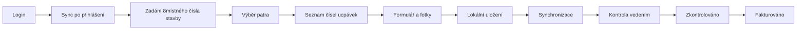
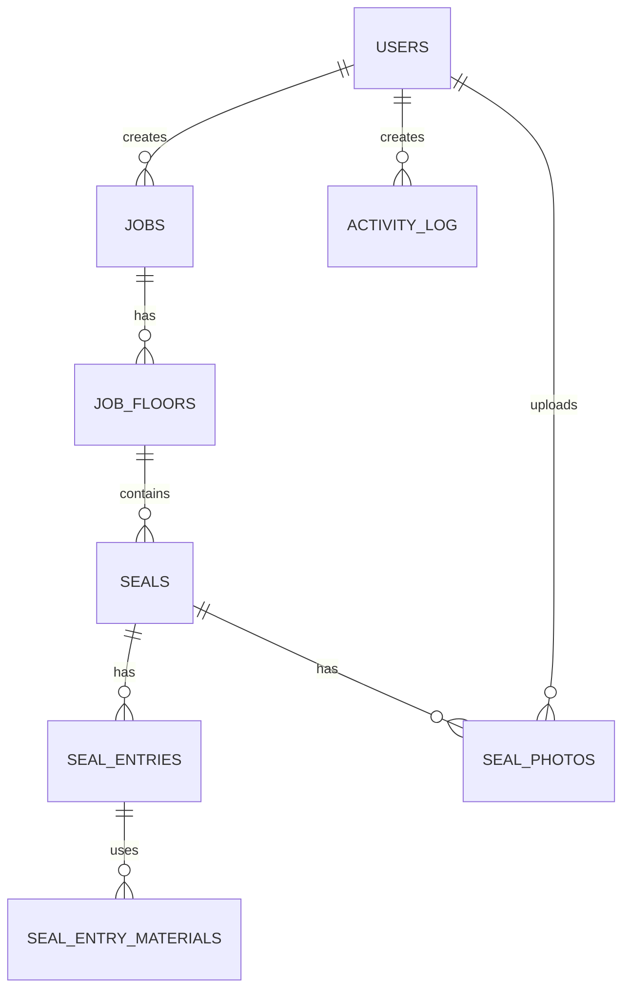

# Diagramy v Mermaid syntaxi

## Workflow

```mermaid
flowchart LR
  A[Login] --> B[Sync po přihlášení]
  B --> C[Zadání 8místného čísla stavby]
  C --> D[Výběr patra]
  D --> E[Seznam čísel ucpávek]
  E --> F[Formulář a fotky]
  F --> G[Lokální uložení]
  G --> H[Synchronizace]
  H --> I[Kontrola vedením]
  I --> J[Zkontrolováno]
  J --> K[Fakturováno]
```

## Datový model

```mermaid
erDiagram
  USERS ||--o{ JOBS : creates
  JOBS ||--o{ JOB_FLOORS : has
  JOB_FLOORS ||--o{ SEALS : contains
  SEALS ||--o{ SEAL_ENTRIES : has
  SEAL_ENTRIES ||--o{ SEAL_ENTRY_MATERIALS : uses
  SEALS ||--o{ SEAL_PHOTOS : has
  USERS ||--o{ SEAL_PHOTOS : uploads
  USERS ||--o{ ACTIVITY_LOG : creates
```
